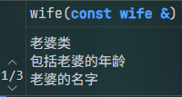

[TOC]

# 第Ⅰ部分 C++基础
## 第一章 开始[^1]
[^1]:这一章本是作为引言,涵盖了大部分c++特性,初学者阅读可能有困难,随着学习的深入,第一章的内容会逐渐明了
### 1.1 编写一个简单的C++程序
+ 操作系统通过调用main来运行C++程序
+ 函数的构成
    + 返回类型
    + 函数名
    + 形参列表（允许为空）
    + 函数体
+ main函数的返回值
    + 0是唯一的成功提示:EXIT_SUCCESS=0
    + EXIT_FILUERE=-1或其他值
#### 1.1.1 编译、运行程序
+ C++程序扩展名
    + cpp(常用)
    + cc
    + cxx(Cmake常用)
    + cp
+ MinGW编译器编译cpp文件:g++ ./main.cpp
    + g++ 为编译器名称
    + ./ 指出要编译的文件所在目录,这里指在根目录
    + main.cpp 指出要编译的文件
Windows环境下会编译出一个名为a.exe的可执行文件
Linux下会编译出一个名为a.out的可执行文件
### 1.2 初始输入输出
+ 标准输入输出对象
    + 标准输入：cin
    + 标准输出：cout
    + 标准错误：cerr
    + 输出一般性信息：clog
+ "<<"运算符
    输出运算符
    接受两个运算对象,左侧必须是ostream对象,例如cout,右侧的运算对象是要打印的值
+ endl
    这是一个特殊值,叫做操纵符
    向cout写入endl后结束当前行,并将缓冲区中的内容刷新
    在cout执行过程中，将输出运算符右侧的内容载入缓冲区,检测到下一个输出运算符或语句结束将清空缓冲区,并打印
+ 命名空间
    在cout等类中,使用前加上std::,这是指出名字cout等是定义在std命名空间中的,可以避免名字定义的冲突,标准库定义的所有名字都在命名空间std中
    觉得麻烦可以在程序前加上using namespace std,但在项目开发中请不要这么做,但可以使用using std::cout;来代替
+  ">>"运算符
    接受两个运算对象,左侧必须是istream对象,例如cin,从给定的istream对象中读取数据并存入右侧对象中,返回其左侧运算对象
### 1.3 注释简介
C++注释有两种
+ //(仅注释双斜杠所在行)
+ /**/(注释两个星号间的所有内容)
对某个类或函数等的描述通常写在其声明上方，这样的注释，现代文本编辑器会在开发者使用的时候给出


### 1.4 控制流
#### 1.4.1 while语句
while语句反复执行一段代码，直到给定条件为假为止
``` cpp
while(条件)
{
    需要反复执行的代码
}
```
#### 1.4.2 for语句
for优化了while在循环结束后循环条件变量依然存在的问题（可以使用free等释放空间，或者再次利用参数），在没有特殊情况下，for更加省心，且可以使用迭代器
``` cpp
for(初始化语句;循环条件;表达式)
{
    需要反复执行的代码
}
// 这种写法与while相同
for(;循环条件;)
{
    需要反复执行的代码
}
```
#### 1.4.3 读取数量不定的数据
由于">>"运算符返回其左侧运算对象,可以使用while实现读取数量不定的数据,当使用一个istream对象(现在是cin)作为条件时,如果流是有效的,则执行循环体,否则反之
+ 对于流无效的说明
  + 1:读取到EOF文件结束符
  + 2:读取无效输入(若流接受一个整形输入,但传入值为浮点型,则为无效输入)
+ 文件结束符
  + Windows:ctrl+Z
  + Linux/macos:ctrl+D
  + 各个终端软件,操作系统,文件编辑器有所不同,不妨自己动手试试( ✿＞◡❛)
#### 1.4.4 if语句
``` cpp
if(判断条件)
{
    在 判断条件 为真时需要执行的代码
}
else
{
    在 判断条件 为假时需要执行的代码
}


if(判断条件1)
{
    在 判断条件1 为真时需要执行的代码
}
else if(判断条件2)
{
    在 判断条件2 为真但是 判断条件1 为假时需要执行的代码
}
else if(判断条件3)
{
    在 判断条件3 为真但是 判断条件1,2 为假时需要执行的代码
}
else
{
    在 判断条件1,2,3 均为假时需要执行的代码
}
```
### 1.5 类简介
（欢迎来到C++）
#### 1.5.1 Sales_item类
使用C++Primer书中配套的Sales_item类用作演示[^2]
[^2]:Sales_item类中提供了许多类的方法，不做一一展示
+ 类的作者定义了类对象可以执行的所有操作
+ 本例中,在我们创建Sales_item对象时,对象的初始化方法;在我们创建完Sales_item对象,对这个对象进行一系列操作,都是类的作者为我们做好的东西,我们只要会用就行了
+ 后续会学习如何封装自己的类
文件的重定向
在进行对程序的测试时,用键盘一个一个输入测试样例显然不太明智,而大多数操作系统支持文件重定向,这允许我们将标准输入输出与文件关联起来
>> 程序名称 \<infile \>outfile

使用这个命令可以让程序里的标准输入读取infile文件里的数据,并通过标准输出打印在outfile文件里


 #### 1.5.2 初识成员函数
 + 成员函数(有时也被称为方法)
   + 成员函数是定义类的一部分的函数，现在可以简单理解为类的创作者所提供给使用者的工具
   + 我们作为类的使用者可以调用成员函数对对象进行一系列操作
 + 调用
   + 我们使用一个类对象的名义来调用成员函数
   + 使用"."点运算符来对对象和成员函数进行链接,表示用某个成员调用类的方法对该对象进行操作
  ### 1.6书店程序

``` cpp
  // 我们的程序会将每个ISBN的所有数据合并起来，存入名为tota1的变量中。我们使用另一个名为trans的变量保存读取的每条销售记录。如果trans和total指向相同的ISBN，我们会更新total的值。否则，我们会打印total的值，并将其重置为刚刚读取的数据
#include <iostream>
#include "src/Sales_item.h"
int main()
{
    Sales_item total; // 保存下一条交易记录的变量
    if (std::cin >> total)
    {
        Sales_item trans; // 保存和的变量
        // 读入并处理剩余交易记录
        while (std::cin >> trans)
        {
            // 如果我们仍在处理相同的书
            if (total.isbn == trans.isbn)
            {
                total += trans;
            }
            else
            {
                // 打印前一本书的结果
                std::cout << total << std::endl;
                total = trans; // total现在表示下一本书的销售额
            }
        }
        std::cout << total << std::endl; // 打印最后一本书的结果
    }
    else
    {
        // 没有输入！警告读者
        std::cerr << "NO data" << std::endl;
        return -1;
    }
    return 0;
}
```
## 第二章 变量和基本类型
### 2.1 基本内置类型
#### 2.1.1 算术类型

|类型|含义|最小尺寸|
|:---:|:---:|:---:|
|bool|布尔类型|未定义|
|char|字符|8位|
|wchar_t|宽字符|16位
|char16_t|Unicode字符|16位|
|char32_t|Unicode字符|32位|
|short|短整型|16位|
|int|整形|16位|
|long|长整型|32位|
|long long|拓展长整型|64位|
|float|单精度浮点型|6位有效数字|
|double|双精度浮点型|10位有效数字|
|long dounle|扩展精度浮点型|10位有效数字|


