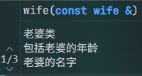

[TOC]

# 第Ⅰ部分 C++基础
## 第一章 开始[^1]
[^1]:这一章本是作为引言,涵盖了大部分c++特性,初学者阅读可能有困难,随着学习的深入,第一章的内容会逐渐明了
### 1.1 编写一个简单的C++程序
+ 操作系统通过调用main来运行C++程序
+ 函数的构成
    + 返回类型
    + 函数名
    + 形参列表（允许为空）
    + 函数体
+ main函数的返回值
    + 0是唯一的成功提示:EXIT_SUCCESS=0
    + EXIT_FILUERE=-1或其他值
#### 1.1.1 编译、运行程序
+ C++程序扩展名
    + cpp(常用)
    + cc
    + cxx(Cmake常用)
    + cp
+ MinGW编译器编译cpp文件:g++ ./main.cpp
    + g++ 为编译器名称
    + ./ 指出要编译的文件所在目录,这里指在根目录
    + main.cpp 指出要编译的文件
Windows环境下会编译出一个名为a.exe的可执行文件
Linux下会编译出一个名为a.out的可执行文件
### 1.2 初始输入输出
+ 标准输入输出对象
    + 标准输入：cin
    + 标准输出：cout
    + 标准错误：cerr
    + 输出一般性信息：clog
+ "<<"运算符
    输出运算符
    接受两个运算对象,左侧必须是ostream对象,例如cout,右侧的运算对象是要打印的值
+ endl
    这是一个特殊值,叫做操纵符
    向cout写入endl后结束当前行,并将缓冲区中的内容刷新
    在cout执行过程中，将输出运算符右侧的内容载入缓冲区,检测到下一个输出运算符或语句结束将清空缓冲区,并打印
+ 命名空间
    在cout等类中,使用前加上std::,这是指出名字cout等是定义在std命名空间中的,可以避免名字定义的冲突,标准库定义的所有名字都在命名空间std中
    觉得麻烦可以在程序前加上using namespace std,但在项目开发中请不要这么做,但可以使用using std::cout;来代替
+  ">>"运算符
    接受两个运算对象,左侧必须是istream对象,例如cin,从给定的istream对象中读取数据并存入右侧对象中,返回其左侧运算对象
### 1.3 注释简介
C++注释有两种
+ //(仅注释双斜杠所在行)
+ /*\*/(注释两个星号间的所有内容)
对某个类或函数等的描述通常写在其声明上方，这样的注释，现代文本编辑器会在开发者使用的时候给出


### 1.4 控制流
#### 1.4.1 while语句
while语句反复执行一段代码，直到给定条件为假为止
``` cpp
while(条件)
{
    需要反复执行的代码
}
```
#### 1.4.2 for语句
for优化了while在循环结束后循环条件变量依然存在的问题（可以使用free等释放空间，或者再次利用参数），在没有特殊情况下，for更加省心，且可以使用迭代器
``` cpp
for(初始化语句;循环条件;表达式)
{
    需要反复执行的代码
}
// 这种写法与while相同
for(;循环条件;)
{
    需要反复执行的代码
}
```
#### 1.4.3 读取数量不定的数据
由于">>"运算符返回其左侧运算对象,可以使用while实现读取数量不定的数据,当使用一个istream对象(现在是cin)作为条件时,如果流是有效的,则执行循环体,否则反之
+ 对于流无效的说明
  + 1:读取到EOF文件结束符
  + 2:读取无效输入(若流接受一个整形输入,但传入值为浮点型,则为无效输入)
+ 文件结束符
  + Windows:ctrl+Z
  + Linux/macos:ctrl+D
  + 各个终端软件,操作系统,文件编辑器有所不同,不妨自己动手试试( ✿＞◡❛)
#### 1.4.4 if语句
``` cpp
if(判断条件)
{
    在 判断条件 为真时需要执行的代码
}
else
{
    在 判断条件 为假时需要执行的代码
}


if(判断条件1)
{
    在 判断条件1 为真时需要执行的代码
}
else if(判断条件2)
{
    在 判断条件2 为真但是 判断条件1 为假时需要执行的代码
}
else if(判断条件3)
{
    在 判断条件3 为真但是 判断条件1,2 为假时需要执行的代码
}
else
{
    在 判断条件1,2,3 均为假时需要执行的代码
}
```
### 1.5 类简介
（欢迎来到C++）
#### 1.5.1 Sales_item类
使用C++Primer书中配套的Sales_item类用作演示[^2]
[^2]:Sales_item类中提供了许多类的方法，不做一一展示
+ 类的作者定义了类对象可以执行的所有操作
+ 本例中,在我们创建Sales_item对象时,对象的初始化方法;在我们创建完Sales_item对象,对这个对象进行一系列操作,都是类的作者为我们做好的东西,我们只要会用就行了
+ 后续会学习如何封装自己的类
+ 文件的重定向
在进行对程序的测试时,用键盘一个一个输入测试样例显然不太明智,而大多数操作系统支持文件重定向,这允许我们将标准输入输出与文件关联起来,使用这个命令可以让程序里的标准输入读取infile文件里的数据,并通过标准输出打印在outfile文件里
\>\> 程序名称 \\<infile \\>outfile

 #### 1.5.2 初识成员函数
 + 成员函数(有时也被称为方法)
   + 成员函数是定义类的一部分的函数，现在可以简单理解为类的创作者所提供给使用者的工具
   + 我们作为类的使用者可以调用成员函数对对象进行一系列操作
 + 调用
   + 我们使用一个类对象的名义来调用成员函数
   + 使用"."点运算符来对对象和成员函数进行链接,表示用某个成员调用类的方法对该对象进行操作
  ### 1.6书店程序

``` cpp
  // 我们的程序会将每个ISBN的所有数据合并起来，存入名为tota1的变量中。我们使用另一个名为trans的变量保存读取的每条销售记录。如果trans和total指向相同的ISBN，我们会更新total的值。否则，我们会打印total的值，并将其重置为刚刚读取的数据
#include <iostream>
#include "src/Sales_item.h"
int main()
{
    Sales_item total; // 保存下一条交易记录的变量
    if (std::cin >> total)
    {
        Sales_item trans; // 保存和的变量
        // 读入并处理剩余交易记录
        while (std::cin >> trans)
        {
            // 如果我们仍在处理相同的书
            if (total.isbn == trans.isbn)
            {
                total += trans;
            }
            else
            {
                // 打印前一本书的结果
                std::cout << total << std::endl;
                total = trans; // total现在表示下一本书的销售额
            }
        }
        std::cout << total << std::endl; // 打印最后一本书的结果
    }
    else
    {
        // 没有输入！警告读者
        std::cerr << "NO data" << std::endl;
        return -1;
    }
    return 0;
}
```
## 第二章 变量和基本类型
### 2.1 基本内置类型
#### 2.1.1 算术类型
c++算术类型 [^3]

|类型|含义|最小尺寸|
|:---:|:---:|:---:|
|bool|布尔类型|未定义|
|char|字符|8位[^4]|
|wchar_t|宽字符|16位|
|char16_t|Unicode字符|16位|
|char32_t|Unicode字符|32位|
|short|短整型|16位|
|int|整形|16位|
|long|长整型|32位|
|long long|拓展长整型|64位|
|float|单精度浮点型|6位有效数字|
|double|双精度浮点型|10位有效数字|
|long dounle|扩展精度浮点型|10位有效数字|

在c++中，整形的大小并非指定不变，但c++规定int至少和short一样大，long至少和一个int一样大，long long至少和一个long一样大

**带符号类型和无符号类型**
以int类型为例,一个int类型的变量在计算机内存中占据了16bit的空间(2个字节)如表格所示
由于数据在计算机中以二进制存储,int类型的变量最多可以表示2^16个数
根据需求不同,可以分为有符号类型和无符号类型
+ 有符号类型:可以表示 -2^15^~2^15^-1和0这2^16^个数
+ 无符号类型可以表示0~2^16^-1这2^16^个数,使用时只需在数据类型前加上unsigned即可
+ 如下图所示，int类型尺寸位16位，每个位可以表示0或者1，这样的组合有2^16^个,因此可以表示2^16^个数字

|  0  |  0  |  0  |  0  |  0  |  0  |  0  |  0  |  0  |  0  |  0  |  0  |  0  |  0  |  0  |  0  |
| :-: | :-: | :-: | :-: | :-: | :-: | :-: | :-: | :-: | :-: | :-: | :-: | :-: | :-: | :-: | :-: |

***内置类型的机器实现***
+ 计算机以比特[^5] (bit)序列存储数据,每个bit非0即1
+ 大多数计算机以2的整数次幂个bit作为块来进行内存管理
+ 可寻址的最小内存块叫做字节(byte),大多数计算机的一个字节由8个bit组成,在c++中一个字节(2^8bit)要能够存储机器基本字符集中的字符,这对应了上表中的char类型
+ 存储的基本单元叫做字(ward),一个字由32bit或64bit组成(这也是32位和64位操作系统本质区别的底层描述)
+ 通常float以1个字来表示,double以2个字来表示
***注意***
+ 在明确知晓数字不可能为负数的时候,请使用无符号类型
+ 在整形运算中,优先考虑int,如果超过,考虑用long long,若还是超过,请移步高精度算法
+ 在算数运算的时候请不要使用char或bool，因为在一些机器上char为有符号，在某些机器上为无符号，如果必须要是有来节约内存，请使用signed char或unsigned char来指定
#### 2.1.2 类型转换
**c++类型转换规则**
+ 将一个非bool的算数值赋值给bool类型时，若非bool类型的值为0，则结果为false，反之怎为true
+ 将浮点数赋给整数类型时，只取小数点前的赋值
+ 将一个整形赋给浮点类型时，小数部分记为0，如果整数超过了浮点类型的容量，则有可能精度损失
+ 当我们给无符号类型赋值一个超出它范围的值的时候，结果是初始值对无符号类型所占空间大小取模的结果，例如将-1 赋值给8bit大小的unsigned char 所得的结果为255(-1%256=255)
+ 当我们赋给带符号类型一个超出它表示范围的值时，结果是未定义的，此时，程序可能继续工作
可能崩溃，也可能生成垃圾数据
+ 即使我们不会故意给一个无符号类型的对象赋一个负数,但其实在int类型和unsigned int进行计算的时候,int类型就会先被转换成unsigned int然后再进行计算
#### 2.1.3 字面值常量
+ 整形和浮点型字面值常量
  + 整形字面值通常有十进制,十六进制,八进制
  + 十进制的字面值是带符号的,但符号并不在字面值之内,其他进制则可能带符号也可能无符号
  + 浮点型字面值为小数或科学计数法
  + 默认浮点型的字面值为double,也可以用后缀来指定
+ 字符和字符串常量
  + 'a' 字符 a ,char类型字面值
  + "a"字符串 a\n ,char类型的数组,由字符和换行符组成
+ 转义序列
  + 由反斜杠和一个特殊字符组成
### 2.4 const限定符

当需要初始化(const对象必须初始化)一个不变的对象时，可以在声明语句前加上const修饰
```cpp
const int MAX = 128;
```
被声明为const的对象名通常为大写
const对象在编译时被编译器替换
const对象通常只在文件内有效,如果在两个文件内初始化了两个同名的const对象,他们不会相互受到影响,只会在文件内部起作用
如果想要初始化一个对全局有效的const对象,要加上extern关键字
```cpp
extern const int MAX = 128;
```
#### 2.4.1 const 的引用
```cpp
const int MAX = 128;

const int &_max = MAX;//对常量的引用

int min = 0;

const int &_min = min;//const引用指向非const对象

//int &_max = MAX; 错误的写法
```
不可以用非const指向const对象
在完成对常量的引用之后不可以通过引用变量修改const对象的内容
允许const引用指向一个非const对象
```cpp
double p = 3.1415;

const int &PI = p;
```
注意上述写法是非常不好的编译器在处理时类似下面的代码
```cpp
const int temp = p;

const int &PI = temp;
```
最后const引用并没有绑定到变量p上,而是绑定到了临时变量temp上,这就失去了引用的意义了
####  2.4.2 指针和const
```cpp
int MAX = 128;

int *const max = MAX;
```
与引用类似,不能通过修改const指针的值来修改变量的值
#### 2.4.3 顶层const
与其他对象不同,指针对象的const可能指的是指针为const,可能指的是指针所指向的对象为const
```cpp
int MAX = 128;
const int* _max = MAX;//底层const
int *const _max = MAX;//顶层const
```
底层const指的是对指针进行const修饰,可以通过修改指针来修改被指向的对象
顶层const指的是对指针所指向的对象进行const修饰,不可以通过指针来修改
#### 2.4.4 constexpr 和常量表达式
*常量表达式*
常量表达式指的是不会改变并且在编译时就能得到结果的表达式
```cpp
const int MAX = 128;

const int _MAX_ = MAX +1;
```
上述两个对象均为常量表达式
```cpp
int temp = 7;

const int size = vector.size();
```
上述两个对象不是常量表达式,一个可以被修改,一个在编译后没有被立刻确定,常量表达式通常被存储在内存的.rodata区上
*constexpr*
将变量声明为constexpr来让编译器确定某个表达式是否为常量表达式
```cpp
constexpr int mf = 20;
```
### 2.5 处理类型
#### 2.5.1 类型别名
+ 传统方法使用typedef来声明
```cpp
typedef double wages;

wages PI = 3.14;
```
+ 使用别名声明
```cpp
using wages = double;

wages PI = 3.14;
```
#### 2.5.2 auto类型说明符
c++11新标准引入了auto
让编译器自己判断对象的类型
使用auto声明对象时必须初始化
#### 2.5.3 decltype类型说明符
decltype选择并返回操作数的类型
```cpp
int x = 9;  

decltype(x) y = 4;
```
上述代码通过x的类型来初始化变量y;
*decltype和引用*
```cpp
int test1 = 4;  
int &test2 = test1;  
  
decltype((test1)) v1 = test1;  
decltype(test2) v2 = test1;
```
让decltype的类型变为引用有两种方法
+ 传入的表达式本身是引用类型
+ 给传入的表达式再加上括号
### 2.6  自定义数据结构
#### 2.6.3 编写自己的头文件
如果写了一个自己的头文件,在main.cpp里使用的时候可能会出现多次包含的情况,这样就会报错
```c
// head.h
#ifndef head.h
#define head.h
//code
#endif

```
这里的意思是:如果没有包含 head.h 就包含head.h,最后结束.
这么写头文件的保护繁琐,而且当重复引用时程序依然要进入头文件里判断,造成极小的性能开销,所以这里推荐第二种方法
```c
#pragma once
```
这是编译器的指令,不用进入文件内部进行检查,没有额外的性能开销,最好的是:他方便,但某些极其老旧或特殊的编译器不支持
## 第五章 语句
### 5.6 try语句块和异常处理
#### 5.6.1 throw 表达式
在throw之前,iostream库中有抛出异常的函数即:std::cerr和std::clog
```cpp
std::cerr<<"error the undefine action"<<std::endl;

std::clog<<"time out"<<std::endl;
```
但严格来讲这并非抛出异常,而是打印了一条错误信息,接下来使用throw真正意义上的抛出异常
```cpp
throw runtime_error ("error the undefine action");
```
在这段代码中,程序抛出了一个runtime_error异常,并把控制权交给能处理该异常的代码.
类型 runtime_error 是标准库异常类型中的一种,定义在stdexcept头文件里.
对于runtime_error 对象,我们必须初始化他,方法是传入string对象或者c风格字符串
#### 5.6.2 try 语句块
```cpp
try {  
    if (false) {  
        throw std::runtime_error("error");  
    }  
} catch (std::runtime_error &err) {  
    std::cerr << err.what() << std::endl;
    }

```
try语句块内的语句可以正常执行,其内部的throw抛出的异常可以被try语句块后的catch语句捕获,并根据catch括号内不同的对象声明(异常声明)执行不同的catch

本例中 catch接收一个runtime_error类型的异常,并声明其对象的引用err,然后进行处理,这里的处理是调用了runtime_error的对象err的what成员,返回异常信息,也就是构造runtime_error对象是的error
#### 5.6.3 标准异常
c++标准库定义了一组类,用于报告异常,他们定义在了一下四个头文件里
+ exception 定义了最通用的异常类exception 他只报告异常的发生，不提供任何额外信息
+ stdexcept 定义了几种常见的异常类

*stdexcept中定义的异常类* 

| 类名               | 描述                      |
| ---------------- | ----------------------- |
| exception        | 最常见的问题                  |
| runtime_error    | 只有在运行时才检测出的问题           |
| range_error      | 运行时错误,生成的结果超出了有意义的范围    |
| overflow_error   | 运行时错误,计算上溢              |
| underflow_error  | 运行时错误,计算下溢              |
| logic_error      | 程序逻辑错误                  |
| domain_error     | 逻辑错误,参数对应的结果值不存在        |
| invalid_argument | 逻辑错误,无效参数               |
| length_error     | 逻辑错误,试图创建一个超出该类型最大长度的对象 |
| out_of_range     | 逻辑错误,使用一个超出有效范围的值       |

## 第八章 IO 库
### 8.1 IO类

[^3]:操作系统类型,操作系统位数的区别,这些类型的最小尺寸不固定
[^4]:一个char的大小和一个机器字节一样
[^5]:即:位