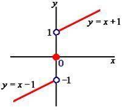
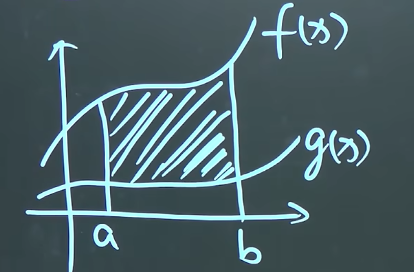
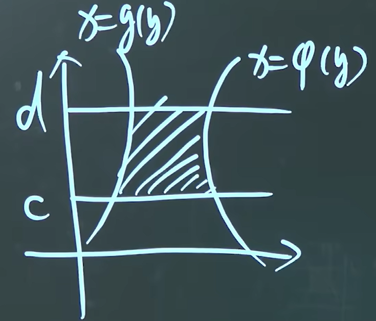
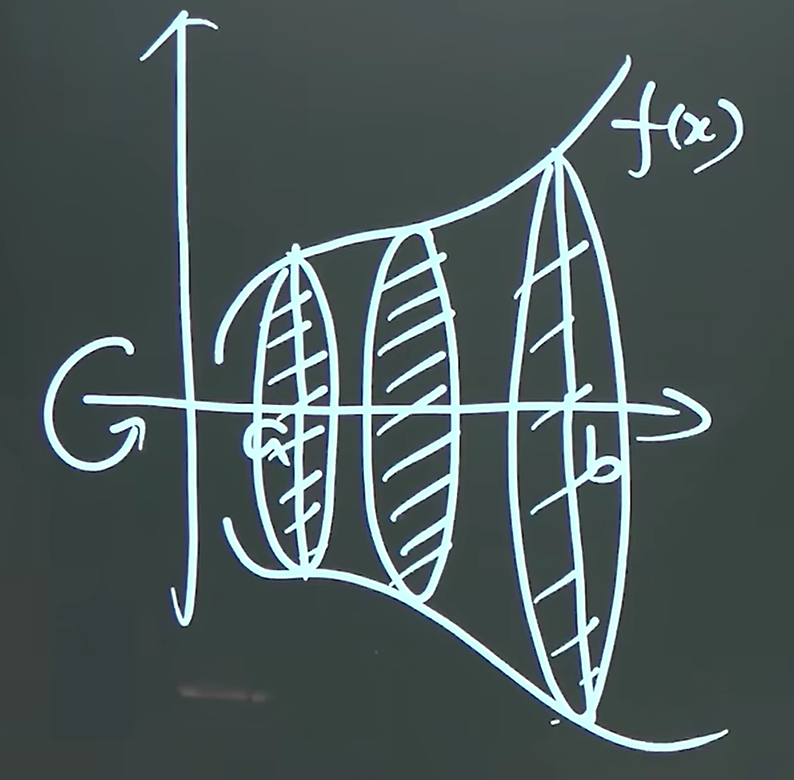
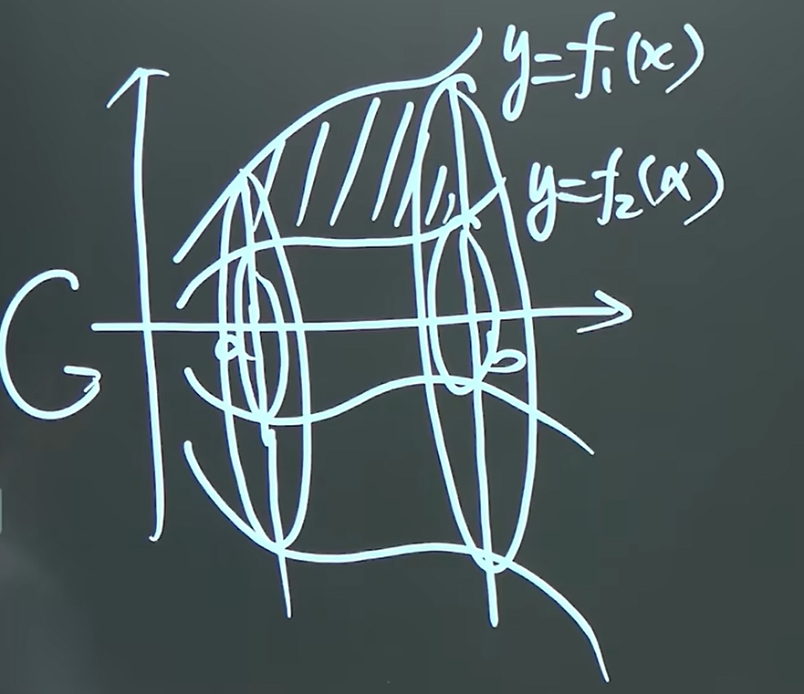

# 焚决

## 积分表

### 普通?函数积分

$$
\int x^n\, dx = \frac{x^{n+1}}{n+1}+c
$$

$$
\int a^x\, dx = \frac{a^x}{\ln a}+c
$$

$$
\int \frac{1}{x}\, dx = \ln\left|x\right|+c
$$

$$
\int\frac{1}{a^2+x^2}\, dx = \frac{1}{a}\arctan\frac{x}{a}+c \qquad \int \frac{1}{\sqrt{a^2+x^2}}\, dx = \ln\left(x+\sqrt{x^2+a^2}\right)+c
$$

$$
\int\frac{1}{a^2-x^2}\, dx =\frac{1}{2a}\ln\left|\frac{a+x}{a-x}\right|+C \qquad \int\frac{1}{\sqrt{x^2-a^2}}\, dx = \ln\left|x+\sqrt{x^2-a^2}\right|+c
$$

### 三角函数积分

$$
\int \tan x\, dx = -\ln\left|\cos x\right|+c \qquad \int \cot x\, dx = \ln\left|\sin x\right|+c\qquad\int \sec x\, dx = \ln \left|\sec x+\tan x\right| +c \qquad\int\csc x\, dx = \ln \left|\csc x-\cot x\right|+c
$$

$$
\int \sec^2x\, dx = \tan x+c  \qquad \int\csc^2x\, dx = -\cot x+c
$$

$$
\int \sec x\cdot\tan x \, dx = \sec x+c \qquad \int \csc x\cdot\cot x\, dx = -\csc x+c
$$

## 三角恒等式

### 半角公式

$$
\sin 2x = 2\sin x\cos x
$$

$$
\cos 2x = \cos^2x-\sin^2x = 2\cos^2x-1 = 1-2\sin^2x
$$

$$
\tan 2x = \frac{2\tan x}{1-\tan^2x}
$$

### 倍角公式

$$
\sin^2x = \frac{1-\cos 2x}{2} \qquad \cos^2x = \frac{1+\cos 2x}{2}
$$

$$
\sin\frac{x}{2} = \sqrt{\frac{1-\cos x}{2}} \qquad \cos\frac{x}{2} = \sqrt{\frac{1+\cos x}{2}}
$$

$$
\tan\frac{x}{2} = \frac{1-\cos x}{\sin x} = \frac{\sin x}{1+\cos x}
$$

### 积化和差

$$
\sin x\cos y = \frac{1}{2}[\sin(x+y)+\sin(x-y)] \qquad \cos x\cos y = \frac{1}{2}[\cos(x+y)+\cos(x-y)]
$$

$$
\sin x\sin y = \frac{1}{2}[\cos(x-y)-\cos(x+y)] \qquad \cos x\sin y = \frac{1}{2}[\sin(x+y)-\sin(x-y)]
$$

### 和差化积

$$
\sin x+\sin y = 2\sin\frac{x+y}{2}\cos\frac{x-y}{2} \qquad \sin x-\sin y = 2\cos\frac{x+y}{2}\sin\frac{x-y}{2}
$$

$$
\cos x+\cos y = 2\cos\frac{x+y}{2}\cos\frac{x-y}{2} \qquad \cos x-\cos y = -2\sin\frac{x+y}{2}\sin\frac{x-y}{2}
$$

## 导数

### 反三角函数求导

$$
(\arcsin x)' = \frac{1}{\sqrt{1-x^2}}
$$

$$
(\arccos x)' =  -\frac{1}{\sqrt{1-x^2}}
$$

$$
(\arctan x)' = \frac{1}{1+x^2}
$$

$$
(\operatorname{arccot}x)'= -\frac{1}{1+x^2}
$$

### 参数方程求导

$$
\frac{dy}{dx} = \frac{dy/dt}{dx/dt}\qquad(y 对 x 求一阶导)
$$

$$
\frac{d^2y}{dx^2} = \frac{d\left(\frac{dy}{dx}\right)/dt}{dx/dt}\qquad(y 对 x 求二阶导)
$$

### 高阶导数

$$
\sin x^{(n)} = \sin\left (x+n\cdot\frac{\pi}{2}\right)
$$

$$
\cos x^{(n)} = \cos\left (x+n\cdot\frac{\pi}{2}\right)
$$

$$
\ln(1+x)^{(n)} = (-1)^{n-1}\cdot\frac{(n-1)!}{(x+1)^n}
$$

$$
(f(x)\cdot g(x))^{(n)} = C_n^0f(x)^{(n)}g(x)^{(0)}+C_n^1f(x)^{(n-1)}g(x)^{(1)}+\dotsb+C_n^nf(x)^{(0)}g(x)^{(n)}
$$

# 极限

## 极限运算法则

+ $\infty + \infty \rightarrow 无结果$
+ $\infty - \infty \rightarrow 无结果$
+ $\frac{\infty}{\infty} \rightarrow 无结果$
+ $\infty \cdot \infty \rightarrow 无结果$
+ 有限个无穷小量和为无穷小
+ 有限个无穷小量相乘为无穷小, 无限个相乘不确定

### 第一重要极限

$\lim\limits_{x\rightarrow 0} \frac{\sin x}{x} = 1$

### 第二重要极限

指数与底数的后半互为倒数

$$
\lim\limits_ {n\rightarrow\infty}\left(1+\frac{1}{n}\right)^n = e
\\
\lim\limits_{n\rightarrow 0}\left(1+n\right)^\frac{1}{n} = e
$$

## 等价无穷小

$$
\lim\limits_{x\rightarrow 0}
\begin{cases}
\sqrt [n]{1+x}-1 = \frac{1}{n}\cdot x
\\
\sin x = x
\\
\tan x = x
\\
\arcsin x = x
\\
\arctan x = x
\end{cases}
$$

## 函数连续

+ $f(x)在x_{0}点连续 : \lim\limits_{x\rightarrow x_0}f(x) = f(x_0)$
  + 左连续: $\lim\limits_{x\rightarrow x_0^-}f(x) = f(x_0)$
  + 右连续: $\lim\limits_{x\rightarrow x_0^+}f(x) = f(x_0)$
+ $f(x)在\left[a,b\right]上连续$
  + $f(x)在\left(a,b\right)上连续$
  + $f(x)在a处右连续,在b处左连续$

## 间断点

### 无穷间断点

+ $\lim\limits_{x\rightarrow x_0^-}f(x)和\lim\limits_{x\rightarrow x_0^+}f(x)均不存在$
  例: $f(x) = \tan x$

<iframe src="https://www.desmos.com/calculator/fjqe8htsgo?embed" width="500" height="500" style="border: 1px solid #ccc" frameborder=0> </iframe>

### 震荡间断点

例: $f(x) = \sin\frac{1}{x}$
<iframe src="https://www.desmos.com/calculator/upumtg93gg?embed" width="500" height="500" style="border: 1px solid #ccc" frameborder=0> </iframe>

### 可去间断点

+ $\lim\limits_{x\rightarrow x_0^-}f(x) = \lim\limits_{x\rightarrow x_0^+}f(x)$
+ $f(x_0)不存在$

例: $f(x) = \frac{x^2-1}{x-1}$
<iframe src="https://www.desmos.com/calculator/j6gvdv7iws?embed" width="500" height="500" style="border: 1px solid #ccc" frameborder=0> </iframe>

### 跳跃间断点

$$
f(x) =\begin{cases}
    x-1(x < 0)\\
    0(x = 0)\\
    x+1(x > 0)
\end{cases}
$$

  **间断点**

+ 第一类间断点: 左右极限均存在
+ 第二类间断点: 左右极限至少有一个不存在

## 微分

$dy = f(x)'\cdot dx$

### 微分近似计算

$f(x+\Delta x) = f(x)+f(x)'\cdot\Delta x$

### 泰勒公式

$e^x = 1 + x + \frac{x^2}{2!} + \frac{x^3}{3!} + \cdots + \frac{x^n}{n!} + o(x^n)$
$\sin x = x - \frac{x^3}{3!} + \frac{x^5}{5!} - \cdots + (-1)^n \frac{x^{2n+1}}{(2n+1)!} + o(x^{2n+2})$
$\cos x = 1 - \frac{x^2}{2!} + \frac{x^4}{4!} - \cdots + (-1)^n \frac{x^{2n}}{(2n)!} + o(x^{2n+1})$
$\ln(1+x) = x - \frac{x^2}{2} + \frac{x^3}{3} - \cdots + (-1)^{n-1} \frac{x^n}{n} + o(x^n)$
$(1+x)^\alpha = 1 + \alpha x + \frac{\alpha(\alpha-1)}{2!}x^2 + \cdots + \frac{\alpha(\alpha-1)\cdots(\alpha-n+1)}{n!}x^n + o(x^n)$

### 微分中值定理

#### 罗尔定理

设函数 $f(x)$ 满足：

+ 在闭区间 $[a,b]$ 上连续；
+ 在开区间 $(a,b)$ 内可导；
+ $f(a) = f(b)$。

则至少存在一点 $\xi \in (a,b)$，使得 $f'(\xi) = 0$

#### 拉格朗日中值定理

设函数 $f(x)$ 满足：

+ 在闭区间 $[a,b]$ 上连续；
+ 在开区间 $(a,b)$ 内可导。

则至少存在一点 $\xi \in (a,b)$，使得
$f'(\xi) = \frac{f(b) - f(a)}{b - a}$
或等价地
$f(b) - f(a) = f'(\xi)(b - a)$

#### 柯西中值定理

设函数 $f(x)$ 和 $g(x)$ 满足：

+ 在闭区间 $[a,b]$ 上连续；
+ 在开区间 $(a,b)$ 内可导；
+ $g'(x) \neq 0$（或至少 $g'(x)$ 与 $f'(x)$ 不同时为零）。

则至少存在一点 $\xi \in (a,b)$，使得
$\frac{f(b) - f(a)}{g(b) - g(a)} = \frac{f'(\xi)}{g'(\xi)}$

# 不定定积分

## 积分法

### 第一换元积分法

$\int u\cdot v'\,dx = \int u\,dv$
人话: 将 $\int$ 内的函数往 $d$ 里面拿, 求其原函数作为新的被积变量

### 第二换元积分法

$\int u\,dv = \int u \cdot v'\,dx$
人话: 将 $d$ 内的函数拿进 $\int$ 里, 求其导函数作为新的积分变量

### 分部积分法

$\int u\,dv = u\cdot v - \int v\,du$
积分函数交换优先级: $e^x>\sin x,\cos x>x>x^2>x^3$

# 定积分

## 定积分的性质

+ $\int_a^af(x)\,dx = 0$
+ $\int_a^bf(x)\,dx = -\int_b^af(x)\,dx$
+ $\int_a^b \left(\alpha f(x)+\beta g(x)\right)\,dx = \alpha\int_a^bf(x)\,dx + \beta\int_a^bg(x)\,dx\qquad(\alpha 和\beta 均为常数)$
+ $\int_a^bf(x)\,dx = \int_a^cf(x)\,dx + \int_c^bf(x)\,dx$
+ $\left|\int_a^bf(x)\,dx\right|\leqslant \int_a^b\left|f(x)\right|\,dx$
+ $若f(x)在[a,b]上连续,则至少 \exist  \xi \in[a,b] 使\int_a^b f(x)\,dx = f(\xi)\cdot(b-a)$
+ $\int_0^\pi x\cdot f(\sin x)\,dx = \frac{\pi}{2}\int_0^\pi f(\sin x)\,dx$

## 微积分基本公式

### 积分求导

$\left(\int_a^{\varphi(x)}f(t)\,dt\right)' = f\left(\varphi(x)\right)\cdot\varphi'(x)$
$\left( \int_{g(x)}^{h(x)} f(t) \, dt \right)' = f(h(x)) \cdot h'(x) - f(g(x)) \cdot g'(x)$
其实这两个公式一样

### 牛顿莱布尼茨公式

$若函数f(x)在区间[a, b]上连续,且F(x)是 f(x)的一个原函数,则$

$\int_a^b f(x) \, dx = F(x)|_a^b = F(b) - F(a)$

## 反常积分

### 无穷限的反常积分

若 $f(x)在[a,+\infty)上连续$
$\int_a^{+\infty}f(x)\,dx = \lim\limits_{b\rightarrow+\infty}\int_a^bf(x)\,dx$
如果极限存在, 则 $\int_a^{+\infty}f(x)\,dx收敛$
如果极限不存在, 则 $\int_a^{+\infty}f(x)\,dx发散$

### 无界函数的反常积分

设函数 \(f(x)\) 在 \((a, b]\) 上有定义，且当 \(x \to a^+\) 时 \(f(x)\) 无界（\(a\) 为瑕点），则定义

$\int_a^b f(x) \, dx = \lim_{\varepsilon \to 0^+} \int_{a+\varepsilon}^b f(x) \, dx,$

若极限存在且有限，则称反常积分 **收敛**，否则 **发散**。

若瑕点 \(c \in (a, b)\)，需拆分：

$\int_a^b f(x) \, dx = \int_a^c f(x) \, dx + \int_c^b f(x) \, dx,$

两个极限分别独立存在时原积分收敛。

## 定积分的应用

### 求面积

#### 直角坐标

**X 型(y 关于 x 的方程 $y = f(x)$)**

$S_{阴影} =\int_a^b\left(f(x)-g(x)\right)\,dx$
**y 型(x 关于 y 的方程 $x=g(y)$)**

$S_{阴影} = \int_c^d\left(\varphi(y)-g(y)\right)\,dy$

#### 极坐标

$\rho = \rho(\theta)\qquad \theta\in[\alpha,\beta]$
$S = \int_\alpha^\beta\frac{1}{2}\rho^2(\theta)\,d\theta$

### 求旋转体的体积

$y = f(x)\qquad x\in[\alpha,\beta]$

$V = \int_\alpha^\beta\pi f^2(x)\,dx$
****
$y_1 = f_1(x) \qquad y_2 = f_2(x)\qquad x\in[\alpha,\beta]$

$V =\pi \int_\alpha^\beta \left(f_1^2(x)-f_2^2(x)\right)\,dx$

### 求弧长

#### 参数方程

$$
弧:\begin{cases}
x = \varphi(t)
\\
y = \varphi(t)
\end{cases}
\\
t\in [\alpha ,\beta]
$$

$
弧长 L = \int_\alpha^\beta\sqrt{[\varphi'(t)]^2 + [\mu'(t)]^2}\, dt
$

#### 直角坐标

$$
y  = f(x) , x\in [a.b]
$$
$$
弧长 L =\int_a^b\sqrt{(f'(x))^2+1}
$$

#### 极坐标

$$
弧:\begin{cases}
x = \varphi(\theta) \cdot\cos \theta
\\
y = \mu(\theta)\cdot\sin \theta
\end{cases}
\\
\theta\in [\alpha ,\beta]
$$
$$
弧长 L = \int_\alpha^\beta\sqrt{\varphi^2(\theta) +[\mu'(\theta)]^2}
$$

# 微分方程

**微分方程**: 含函数的导数或微分的方程
**微分方程的阶数**: 未知函数的导数的最高阶数

## 可分离变量的微分方程

+ 将 x 和 y 分别放在等号两边
+ 对两边同时求不定积分

## 齐次方程

$\frac{dy}{dx} = g\left(\frac{y}{x}\right)\Rightarrow\frac{y}{x}整体出现$

+ ① 设 $\frac{y}{x} = u$
+ ② $y = x\cdot u$
+ ③ $\frac{dy}{dx} = u+x\cdot \frac{du}{dx}$
$\frac{dy}{dx} = g\left(\frac{y}{x}\right)\Rightarrow u+x\cdot \frac{du}{dx} = g(u)\Rightarrow 可分离变量的微分方程$

## 一阶线性微分方程

**未知函数满足线性关系即为线性微分方程**
$$
\frac{dy}{dx} + P(x)y = Q(x)
$$

+ **$Q(x) = 0$**
  一阶齐次线性方程
  + 1: 分离 x 与 y, 写在等号两边
  + 2: 两边求积分
+ **$Q(x)\not = 0$**
   一阶非齐次线性微分方程
  + ① 化成标准形式 $y'+P(x)y = Q(x)0$
  + ② $y=e^{-\int P(x)\,dx}\cdot \left(\int Q(x)\cdot e^{\int P(x)\, dx}\,dx +c\right)$

## 伯努利方程

$y'+P(x)y = Q(x)\cdot y^n$

+ ① 两边除以 $y^n$
  $y^{-n}\cdot y'+P(x)y^{1-n} = Q(x)$
+ ② 转化
    $y^{-n}\cdot \frac{dy}{dx}+P(x)y^{1-n} = Q(x)$
    $\frac{1}{1-n}\cdot\frac{dy^{1-n}}{dx}+P(x)y^{1-n} = Q(x)$
+ ③ 令 $z = y^{1-n}$
  $z'+(1-n)P(x)\cdot z = (1-n)Q(x)$

## 可降阶的高阶微分方程

**(1) $y^{(n)} = f(x)$**
两边求 n 阶导
**(2)$y^{(n)} = f\left(x,y^{(n-1)}\right)$**
① 令 $u = y^{(n-1)} \Rightarrow u' = y^{(n)}$
② 求解微分方程
**(3)$y'' = f(y,y')$**
① 令 $y' = p \Rightarrow y'' = p\cdot \frac{dp}{dy}$
② $p\cdot \frac{dp}{dy} = f(y,y')$
③ 求解

## 二阶常系数线性微分方程

**标准形式: $y''+py'+qy = f(x)$**

### 二阶常系数齐次线性微分方程($f(x) = 0$)

① $y''\rightarrow r^2,y'\rightarrow r,y\rightarrow 1$
$特征方程:r^2+pr+q = 0$
② 求解 $r_1,r_2$

$$
\begin{cases}
  r_1 \not = r_2 \rightarrow \qquad y_1 = e^{r_1x}, y_2 = e^{r_2x}
  \\
  r_1 = r_2 \rightarrow \qquad y_1 = e^{r_1x}, y_2 = xe^{r_1x},
  \\
  两个共轭复根\rightarrow\qquad y_1 = e^{\alpha x}\cos\beta x, y_2 = e^{\alpha x}\sin \beta x \qquad(r = \alpha \pm\beta i)
\end{cases}
\\
y = c_1y_1+c_2y_2
$$

### 二阶常系数齐次线性微分方程($f(x)\not = 0$)

① 设 $\overline{y}$ 为 $y''+py'+qy = 0的通解$
  $y^*$ 为 $y''+py'+qy = f(x)$ 的一个特解
② $y''+py'+qy = f(x)$ 的通解为 $y = \overline{y}+y^*$

# 曲面方程

## 平面点法式

一个平面的法向量为 $\vec{n} = (A,B,C,)$ 平面上有一点为 $P(x_0,y_0,z_0)$
则, 该平面的点法式为 $A(x-x_0)+B(y-y_0)+C(z-z_0) = 0$
****
若某个平面的方程为 $Ax+By+Cz+d = 0 \qquad 则其法向量\vec{n} = (A,B,C)$

# 偏导数

**对 x 的偏导数**

令 $y = y_0 \qquad \lim\limits_{\Delta x \rightarrow 0}\frac{f(x_0+\Delta x,y_0)-f(x_0,y_0)}{\Delta x}存在$
表示: $\left. \frac{\partial f}{\partial x} \right|_{\substack{x=x_0 \\ y=y_0}}或f_x(x_0,y_0)$
**对 x 的偏导数**
令 $x = x_0 \qquad \lim\limits_{\Delta y \rightarrow 0}\frac{f(x_0,y_0+\Delta y)-f(x_0,y_0)}{\Delta y}存在$
表示: $\left. \frac{\partial f}{\partial y} \right|_{\substack{x=x_0 \\ y=y_0}}或f_y(x_0,y_0)$

## 求偏导数法则

**对 x 求偏导**: 将 y 看作常数, 对 x 求导
**对 y 求偏导**: 将 x 看作常数, 对 y 求导

## 高阶偏导数

+ 对 x 的二阶偏导: $f_{xx}(x,y) = \frac{\partial}{\partial x}\left(\frac{\partial f}{\partial x}\right)$
+ 混合偏导: $f_{xy} (x,y) = \frac{\partial}{\partial y}\left(\frac{\partial f}{\partial x}\right)$$
**二阶混合偏导数若连续, 则必相等**

# 全微分

**偏增量**
$f(x+\Delta x,y) - f(x+y) \approx f_x(x,y)\Delta x$
$f(x,y+\Delta y) - f(x+y) \approx f_y(x,y)\Delta y$
其中, 约等号左边为 **偏增量**, 右边为 **偏微分**
**全增量**
$\Delta z  = f(x + \Delta x,y+ \Delta y) -f(x,y)$
$\Delta z =f_x(x,y)\Delta x +f_y(x,y)\Delta y + o(\rho) \qquad 若满足\rho = \sqrt{(\Delta x)^2+(\Delta y)^2}则z = f(x,y)可微分$

其中 **全微分**: $dz = f_x(x,y)\Delta x +f_y(x,y)\Delta y$

+ 若二元函数可偏导, 这个二元函数不一定连续
+ 若二元函数可微分, 这个二元函数连续
+ 若二元函数的偏导存在且连续, 则其可微分
+ 若二元函数可微分, 则其偏导必存在, 且 $d z =f_x(x,y)d x +f_y(x,y)d y$

# 多元函数的求导法则

## 关于单变量

$$
z = f(u, v) \qquad
\begin{cases}
u = \varphi (t)
\\
v = \mu(t)
\end{cases}
$$

$$
\Downarrow
$$

$$
\frac{dz}{dt} = \frac{\partial z}{\partial u}\cdot \frac{du}{dt}+\frac{\partial z}{\partial v}\cdot \frac{dv}{dt}
$$
## 关于多变量
$$
z = f(u, v) \qquad
\begin{cases}
u = \varphi (x, y)
\\
v = \mu(x, y)
\end{cases}
$$

$$
\Downarrow
$$

$$
\begin{cases}
\frac{\partial z}{\partial x} = \frac{\partial z}{\partial u}\cdot \frac{\partial u}{\partial x} + \frac{\partial z}{\partial v}\cdot \frac{\partial v}{\partial x}
\\
\frac{\partial z}{\partial y} = \frac{\partial z}{\partial u}\cdot \frac{\partial u}{\partial y} + \frac{\partial z}{\partial v}\cdot \frac{\partial v}{\partial y}
\end{cases}
$$

## 部分关于多变量
$$
z = f(u, v) \qquad
\begin{cases}
u = \varphi (x, y)
\\
v = \mu(y)
\end{cases}
$$

$$
\Downarrow
$$

$$
\begin{cases}
\frac{\partial z}{\partial x} = \frac{\partial z}{\partial u}\cdot \frac{\partial u}{\partial x}
\\
\frac{\partial z}{\partial y} = \frac{\partial z}{\partial u}\cdot \frac{\partial u}{\partial y} + \frac{\partial z}{\partial v}\cdot \frac{d v}{d y}
\end{cases}
$$

**一元函数: 求导, 多元函数: 求偏导**

# 全微分形式不变性
$$
z = f(u, v) \qquad dz =\frac{\partial z}{\partial u}du+ \frac{\partial z}{\partial v}dv
$$

# 隐函数求导法则

## 一元函数隐函数求导
1: 直接进行隐函数求导即可

2:$若 F(x, y)是关于 x, y 的二元函数 \qquad 且 F(x, y) = 0$

$\frac{dy}{dx} = -\frac{F_x(x,y)}{F_y(x,y)}$
## 多元函数隐函数求导
### 常规多元函数
$F(x,y,z) = 0$
$\frac{\partial z}{\partial x} = \frac{F_x(x,y,z)}{F_z(x,y,z)}$
$\frac{\partial z}{\partial y} = \frac{F_y(x,y,z)}{F_z(x,y,z)}$

### 多元函数方程组
$$
\begin{cases}
  xu-yv = 0
  \\
  yu+xv = 0
\end{cases}
\qquad
\begin{cases}
u = \varphi(x, y) 
\\
v = \mu(x, y)
\end{cases}
$$
两边同时对 x 求偏导
$$
\begin{cases}
u+xu_x-yv_x = 0
\\
yu_x+v+xv_x = 0
\end{cases}
$$
$$
\qquad\Downarrow
$$

$$
\begin{cases}
xu_x-yv_x =-u
\\
yu_x+xv_x = -v
\end{cases}
\Rightarrow
\begin{cases}
u_x = \frac {\left|\begin{array} {c}-u&-y \\ -v&x\end{array}\right|}{\left|\begin{array}{c}x & -y \\ y & x\end{array}\right|}
\\
v_x = \frac {\left|\begin{array} {c}x&-u \\ y&-v\end{array}\right|}{\left|\begin{array}{c}x & -y \\ y & x\end{array}\right|}
\end{cases}
$$

# 一元向量值函数及其导数

## 一元向量值函数
### 由曲线确定的向量
$$曲线:\begin{cases}
  x = \varphi (t)
  \\
  y = \mu(t)
  \\
  z = \omega(t)
\end{cases}$$
$则向量 :\vec{f(t)} = \left(\varphi(t),\mu(t),\omega(t)\right)$
### 向量极限
$\lim\limits_{t \rightarrow t_0}\vec{f(t)} = \left(\lim\limits_{t \rightarrow t_0}f_1(t),\lim\limits_{t \rightarrow t_0}f_2(t),\lim\limits_{t \rightarrow t_0}f_3(t)\right)$

# 空间曲线的切线与法平面

$设空间曲线:\vec{f(x)} = \left(\varphi (t), \mu (t),\omega(t) \right)$
$切向量 : \vec{T} = \vec{f'(x)} = \left(\varphi' (t), \mu '(t),\omega'(t) \right)$

## 空间曲线的切线
点向式 : $\frac{x-x_0}{\varphi' (t)} = \frac{y-y_0}{\mu '(t)} = \frac{z-z_0}{\omega'(t)}$
## 空间曲线的法平面
点法式: $\varphi' (t)\cdot(x-x_0) + \mu '(t)\cdot(y-y_0)+\omega'(t)\cdot(z-z_0)$
# 空间曲面的切平面与法线
设空间曲面F(x,y,z) = 0
$\vec{n} = \left(F_x(x_0,y_0,z_0),F_y(x_0,y_0,z_0),F_z(x_0,y_0,z_0)\right)$
### 空间曲面的切平面
点法式:$F_x(x_0,y_0,z_0)(x-x_0) + F_y(x_0,y_0,z_0)(y-y_0) + F_z(x_0,y_0,z_0)(z-z_0) = 0$
### 空间曲面的法线
点向式: $\frac{x-x_0}{F_x(x_0,y_0,z_0)} = \frac{y-y_0}{F_y(x_0,y_0,z_0)} = \frac{z-z_0}{F_z(x_0,y_0,z_0)}$
# 方向导数与梯度
## 方向导数
$\begin{cases}
  x =x_0+t\cos \alpha
  \\
  y = y_0+t \cos \beta
\end{cases}$
t为变化前的点和变化后的点之间的距离
$\frac{\partial f}{\partial l} = \lim\limits_{t\rightarrow0^+}\frac{f(x_0+t\cos \alpha,y_0+t \cos \beta) - f(x_0,y_0)}{t}$

**$定理:f(x,y)在p_0可微分,则沿任意方向l的方向导数存在,且\frac{\partial f}{\partial l}|_{(x_0,y_0)} = f_x(x_0,y_0)\cos \alpha +f_y(x_0,y_0)\cos \beta$**
## 梯度
**梯度是一个向量**

$设函数:z=f(x,y) 点p_0(x_0,y_0)在函数上$
$则函数在p_0处的梯度为 \nabla f(x_0,y_0) = f_x(x_0,y_0)\vec{i}+f_y(x_0,y_0)\vec{j} 即为\left(f_x(x_0,y_0),f_y(x_0,y_0)\right)$

结合方向导数:
$\frac{\partial f}{\partial l}|_{(x_0,y_0)} = \left(f_x(x_0,y_o),f_y(x_0.y_0)\right)\cdot(\cos \alpha ,\cos \beta)$(注:此为两个向量的数量积)
$= \left| \nabla f(x_0,y_0)\right| \cdot \cos \theta \qquad \theta 为 梯度与p_0处方向的夹角$ 
+ 梯度方向:在$p_0 点,z=f(x,y) 增加最快的方向$
+ 梯度反方向:在$p_0 点,z=f(x,y) 减少最快的方向$
+ 与梯度成$90^。方向: 函数值变化率为0$
### 等值线
$\begin{cases}
  z=f(x,y)
  \\
  z = c
\end{cases}$
$等值线 f(x,y) = c 在(x_0,y_0) 处的切线斜率为 k_1 = -\frac{f_x(x_0,y_0)}{f_y(x_0,y_0)}$
$法线斜率:k_2 =\frac{f_y(x_0,y_0)}{f_x(x_0,y_0)}$
$则法向量:\vec{n} = \left(f_x(x_0,y_o),f_y(x_0.y_0)\right)\qquad即:法向量\vec{n} =\frac{\nabla f(x_0,y_0)}{\left|\nabla f(x_0,y_0)\right|}$
$可得出:\frac{\partial f}{\partial n} = |\nabla f(x_0,y_0)|\qquad方向导数=梯度的模$
# 多元函数的极值

## 必要条件
$若z=f(x,y) 在点(x_0,y_0)有偏导数,且点(x_0,y_0)可以取到极值,则 f_x(x_0,y_0) = 0,f_y(x_0,y_0) = 0,(x_0,y_0)为驻点$
## 充分条件
+ ①$令 f_x(x,y) =0\qquad f_y(x,y) =0 求驻点(x_0,y_0)$
+ ②$A=f_{xx}(x_0,y_0), B = f_{xy}(x_0,y_0),C = f_{yy}(x_0,y_0)$
  + 若$AC-B^2>0,则f(x,y)有极值$
    + $若A>0,有极小值,极小值为f(x_0,y_0)$
    + $若A<0,有极大值,极大值为f(x_0,y_0)$
  + 若$AC-B^2<0,则f(x,y)无极值$
  + 若$AC-B^2=0,则无法确定$

# 二重积分

## 二重积分的定义与性质

### 定义

设 $f(x,y)$ 是有界闭区域 $D$ 上的有界函数。将 $D$ 任意分成 $n$ 个小闭区域 $\Delta\sigma_1,\Delta\sigma_2,\dots,\Delta\sigma_n$（也用 $\Delta\sigma_i$ 表示其面积），在每个 $\Delta\sigma_i$ 上任取一点 $(\xi_i,\eta_i)$，作乘积 $f(\xi_i,\eta_i)\Delta\sigma_i$ 并求和 $\sum_{i=1}^n f(\xi_i,\eta_i)\Delta\sigma_i$。当各小区域直径的最大值 $\lambda\to0$ 时，若该和的极限存在且与分割及取点无关，则称此极限值为 $f(x,y)$ 在 $D$ 上的二重积分，记作

$$
\iint_D f(x,y)\,d\sigma = \lim_{\lambda\to0}\sum_{i=1}^n f(\xi_i,\eta_i)\Delta\sigma_i
$$

其中 $f(x,y)$ 称为**被积函数**，$D$ 称为**积分区域**，$d\sigma$ 称为**面积元素**。

**可积条件：** 若 $f(x,y)$ 在闭区域 $D$ 上连续，则 $f(x,y)$ 在 $D$ 上可积。

**几何意义：** 当 $f(x,y)\geqslant0$ 时，二重积分 $\iint_D f(x,y)\,d\sigma$ 等于以 $D$ 为底、以 $f(x,y)$ 为曲顶的曲顶柱体的体积。

### 性质

1. **线性性质：**
   $$
   \iint_D \bigl(\alpha f(x,y)+\beta g(x,y)\bigr)\,d\sigma = \alpha\iint_D f(x,y)\,d\sigma + \beta\iint_D g(x,y)\,d\sigma
   $$

2. **可加性：** 若 $D = D_1\cup D_2$ 且 $D_1\cap D_2$ 无内点，则
   $$
   \iint_D f(x,y)\,d\sigma = \iint_{D_1} f(x,y)\,d\sigma + \iint_{D_2} f(x,y)\,d\sigma
   $$

3. **保号性：** 若在 $D$ 上 $f(x,y)\geqslant g(x,y)$，则 $\iint_D f(x,y)\,d\sigma \geqslant \iint_D g(x,y)\,d\sigma$

4. **估值不等式：** 设 $M,m$ 分别为 $f(x,y)$ 在 $D$ 上的最大值与最小值，$\sigma$ 为 $D$ 的面积，则
   $$
   m\sigma \leqslant \iint_D f(x,y)\,d\sigma \leqslant M\sigma
   $$

5. **中值定理：** 若 $f(x,y)$ 在闭区域 $D$ 上连续，则至少存在一点 $(\xi,\eta)\in D$，使得
   $$
   \iint_D f(x,y)\,d\sigma = f(\xi,\eta)\cdot\sigma
   $$

## 二重积分 | 直角坐标

直角坐标下面积元素 $d\sigma = dx\,dy$，即

$$
\iint_D f(x,y)\,d\sigma = \iint_D f(x,y)\,dx\,dy
$$

### X 型区域

若区域 $D$ 可表示为 $a\leqslant x\leqslant b,\;\varphi_1(x)\leqslant y\leqslant\varphi_2(x)$，则

$$
\iint_D f(x,y)\,dx\,dy = \int_a^b \left[\int_{\varphi_1(x)}^{\varphi_2(x)} f(x,y)\,dy\right]dx
$$

**计算步骤：** 先对 $y$ 积分（将 $x$ 视为常数），再对 $x$ 积分。

### Y 型区域

若区域 $D$ 可表示为 $c\leqslant y\leqslant d,\;\psi_1(y)\leqslant x\leqslant\psi_2(y)$，则

$$
\iint_D f(x,y)\,dx\,dy = \int_c^d \left[\int_{\psi_1(y)}^{\psi_2(y)} f(x,y)\,dx\right]dy
$$

**计算步骤：** 先对 $x$ 积分（将 $y$ 视为常数），再对 $y$ 积分。

> 若 $D$ 既非 X 型也非 Y 型，可用平行于坐标轴的直线将 $D$ 划分为若干 X 型或 Y 型子区域，利用可加性分别积分后相加。

## 二重积分 | 极坐标

当积分区域为圆域、环域或扇形区域时，通常用极坐标计算更简便。

**坐标变换：**
$$
\begin{cases}
x = r\cos\theta \\[2pt]
y = r\sin\theta
\end{cases}
\qquad (r\geqslant0,\;0\leqslant\theta\leqslant2\pi)
$$

**面积元素：** $dx\,dy = r\,dr\,d\theta$

$$
\iint_D f(x,y)\,dx\,dy = \iint_D f(r\cos\theta,\,r\sin\theta)\;r\,dr\,d\theta
$$

### 极坐标下的积分次序

先对 $r$ 积分（将 $\theta$ 视为常数），再对 $\theta$ 积分。

**常见情形：**

1. 极点位于区域 $D$ 外部（$D$ 由射线 $\theta=\alpha,\theta=\beta$ 与曲线 $r=r_1(\theta),r=r_2(\theta)$ 围成）：
   $$
   \iint_D f(r\cos\theta,r\sin\theta)\,r\,dr\,d\theta = \int_\alpha^\beta d\theta \int_{r_1(\theta)}^{r_2(\theta)} f(r\cos\theta,r\sin\theta)\,r\,dr
   $$

2. 极点位于区域 $D$ 内部边界上（$D$ 由 $\theta=\alpha,\theta=\beta$ 与 $r=r(\theta)$ 围成）：
   $$
   \iint_D f(r\cos\theta,r\sin\theta)\,r\,dr\,d\theta = \int_\alpha^\beta d\theta \int_0^{r(\theta)} f(r\cos\theta,r\sin\theta)\,r\,dr
   $$

3. 极点位于区域 $D$ 内部（$D$ 由曲线 $r=r(\theta)$ 围成）：
   $$
   \iint_D f(r\cos\theta,r\sin\theta)\,r\,dr\,d\theta = \int_0^{2\pi} d\theta \int_0^{r(\theta)} f(r\cos\theta,r\sin\theta)\,r\,dr
   $$

## 无界区域上的广义二重积分与积分区域对称性

### 无界区域上的广义二重积分

若积分区域 $D$ 是无界区域（如全平面、半平面、有界区域外部等），则定义广义二重积分为有界子区域上二重积分的极限。

**定义：** 设 $D$ 为无界区域，$f(x,y)$ 在 $D$ 上连续。取一列有界闭区域 $\{D_n\}$ 满足 $D_1\subset D_2\subset\cdots\subset D_n\subset\cdots$ 且 $\bigcup_{n=1}^\infty D_n = D$。若极限
$$
\iint_D f(x,y)\,d\sigma = \lim_{n\to\infty}\iint_{D_n} f(x,y)\,d\sigma
$$
存在且与 $\{D_n\}$ 的取法无关，则称广义二重积分**收敛**，否则**发散**。

**常用取法：**
- 全平面：$D_n: x^2+y^2\leqslant R^2$，再令 $R\to+\infty$
- 无界扇形：$D_n: a\leqslant r\leqslant R,\;\alpha\leqslant\theta\leqslant\beta$，再令 $R\to+\infty$
- 带形区域：$D_n: a\leqslant x\leqslant b,\;c\leqslant y\leqslant n$，再令 $n\to+\infty$

**例：** 计算 $\iint\limits_{x^2+y^2\leqslant+\infty} e^{-(x^2+y^2)}\,dx\,dy$

$$
\begin{aligned}
\iint\limits_{x^2+y^2\leqslant R^2} e^{-(x^2+y^2)}\,dx\,dy
&= \int_0^{2\pi}d\theta\int_0^R e^{-r^2}\cdot r\,dr \\
&= 2\pi\cdot\left[-\frac12 e^{-r^2}\right]_0^R = \pi(1-e^{-R^2})
\end{aligned}
$$

令 $R\to+\infty$ 得：$\iint_{\mathbb{R}^2} e^{-(x^2+y^2)}\,dx\,dy = \pi$

**常用结论：** $\iint_{\mathbb{R}^2} e^{-(x^2+y^2)}\,dx\,dy = \pi$，由此可推出 $\int_{-\infty}^{+\infty} e^{-x^2}\,dx = \sqrt{\pi}$

### 对称性（奇偶性）

利用积分区域的对称性和被积函数的奇偶性可以简化二重积分计算。

### 积分区域关于x轴对称

若 $D$ 关于 $x$ 轴对称（即 $(x,y)\in D \Rightarrow (x,-y)\in D$），记 $D_1 = D\cap\{y\geqslant0\}$ 为上半部分，则

$$
\iint_D f(x,y)\,d\sigma = 
\begin{cases}
2\displaystyle\iint_{D_1} f(x,y)\,d\sigma, & f(x,-y)=f(x,y)\quad(\text{关于 }y\text{ 为偶}) \\[8pt]
0, & f(x,-y)=-f(x,y)\quad(\text{关于 }y\text{ 为奇})
\end{cases}
$$

**例：** $\iint\limits_{x^2+y^2\leqslant1} y\,dx\,dy$，区域关于 $x$ 轴对称，被积函数 $y$ 关于 $y$ 为奇 $\Rightarrow$ 积分为 $0$。

### 积分区域关于y轴对称

若 $D$ 关于 $y$ 轴对称（即 $(x,y)\in D \Rightarrow (-x,y)\in D$），记 $D_2 = D\cap\{x\geqslant0\}$ 为右半部分，则

$$
\iint_D f(x,y)\,d\sigma = 
\begin{cases}
2\displaystyle\iint_{D_2} f(x,y)\,d\sigma, & f(-x,y)=f(x,y)\quad(\text{关于 }x\text{ 为偶}) \\[8pt]
0, & f(-x,y)=-f(x,y)\quad(\text{关于 }x\text{ 为奇})
\end{cases}
$$

**例：** $\iint\limits_{x^2+y^2\leqslant1} x\,dx\,dy$，区域关于 $y$ 轴对称，被积函数 $x$ 关于 $x$ 为奇 $\Rightarrow$ 积分为 $0$。

### 积分区域关于原点对称

若 $D$ 关于原点对称（即 $(x,y)\in D \Rightarrow (-x,-y)\in D$），记 $D_3$ 为 $D$ 的任意一半（如 $x\geqslant0$ 部分），则

$$
\iint_D f(x,y)\,d\sigma = 
\begin{cases}
2\displaystyle\iint_{D_3} f(x,y)\,d\sigma, & f(-x,-y)=f(x,y) \\[8pt]
0, & f(-x,-y)=-f(x,y)
\end{cases}
$$

**注意：** 关于原点对称等价于先关于 $x$ 轴对称再关于 $y$ 轴对称的复合。

### 积分区域关于$y=x$对称

若 $D$ 关于直线 $y=x$ 对称（即 $(x,y)\in D \Rightarrow (y,x)\in D$），则

$$
\iint_D f(x,y)\,d\sigma = \iint_D f(y,x)\,d\sigma
$$

特别地：
- 若 $f(x,y)=f(y,x)$（对称函数），则此即为原积分本身，无简化，但可与对称轮换技巧结合使用。
- **常用技巧：** $\iint_D f(x,y)\,d\sigma = \frac12\iint_D \bigl[f(x,y)+f(y,x)\bigr]\,d\sigma$，可使某些复杂积分简化。

**例：** 计算 $\iint\limits_{0\leqslant x,y\leqslant1} \frac{x^2}{1+x^2+y^2}\,dx\,dy$

由对称性，$\iint_D \frac{x^2}{1+x^2+y^2}\,dx\,dy = \iint_D \frac{y^2}{1+x^2+y^2}\,dx\,dy$，则

$$
\iint_D \frac{x^2}{1+x^2+y^2}\,dx\,dy = \frac12\iint_D \frac{x^2+y^2}{1+x^2+y^2}\,dx\,dy
$$

# 三重积分

## 三重积分的定义

设 $f(x,y,z)$ 是空间有界闭区域 $\Omega$ 上的有界函数。将 $\Omega$ 任意分成 $n$ 个小闭区域 $\Delta V_1,\Delta V_2,\dots,\Delta V_n$（也用 $\Delta V_i$ 表示其体积），在每个 $\Delta V_i$ 上任取一点 $(\xi_i,\eta_i,\zeta_i)$，作和 $\sum_{i=1}^n f(\xi_i,\eta_i,\zeta_i)\Delta V_i$。当各小区域直径的最大值 $\lambda\to0$ 时，若该和的极限存在且与分割及取点无关，则称此极限值为 $f(x,y,z)$ 在 $\Omega$ 上的三重积分，记作

$$
\iiint_\Omega f(x,y,z)\,dV = \lim_{\lambda\to0}\sum_{i=1}^n f(\xi_i,\eta_i,\zeta_i)\Delta V_i
$$

其中 $dV$ 称为**体积元素**。

**可积条件：** 若 $f(x,y,z)$ 在闭区域 $\Omega$ 上连续，则 $f(x,y,z)$ 在 $\Omega$ 上可积。

## 投影法（先一后二）

将空间区域 $\Omega$ 投影到 $xOy$ 平面，得到投影区域 $D_{xy}$。对 $D_{xy}$ 内任一点 $(x,y)$，过该点作平行于 $z$ 轴的直线穿过 $\Omega$，穿入点为 $z=z_1(x,y)$，穿出点为 $z=z_2(x,y)$，则

$$
\iiint_\Omega f(x,y,z)\,dV = \iint_{D_{xy}} \left[\int_{z_1(x,y)}^{z_2(x,y)} f(x,y,z)\,dz\right] dx\,dy
$$

**计算步骤：** 先对 $z$ 积分（将 $x,y$ 视为常数），再对 $x,y$ 作二重积分。

类似地，也可投影到 $xOz$ 平面或 $yOz$ 平面：

- 投影到 $xOz$ 平面：$\displaystyle\iiint_\Omega f(x,y,z)\,dV = \iint_{D_{xz}} \left[\int_{y_1(x,z)}^{y_2(x,z)} f(x,y,z)\,dy\right] dx\,dz$
- 投影到 $yOz$ 平面：$\displaystyle\iiint_\Omega f(x,y,z)\,dV = \iint_{D_{yz}} \left[\int_{x_1(y,z)}^{x_2(y,z)} f(x,y,z)\,dx\right] dy\,dz$

## 截面法（先二后一）

用平行于 $xOy$ 平面的平面 $z=z$ 截区域 $\Omega$，得到截面区域 $D_z$，$z$ 的取值范围为 $[c,d]$，则

$$
\iiint_\Omega f(x,y,z)\,dV = \int_c^d \left[\iint_{D_z} f(x,y,z)\,dx\,dy\right] dz
$$

**计算步骤：** 先对 $x,y$ 作二重积分（将 $z$ 视为常数），再对 $z$ 积分。

类似地，也可沿 $x$ 轴或 $y$ 轴方向截取截面。

> **适用场景：** 当截面 $D_z$ 的面积或截面上的二重积分容易计算时（例如 $D_z$ 为圆、椭圆等规则图形），截面法尤为简便。

## 柱坐标

当积分区域具有柱面对称性（如圆柱、圆锥、旋转抛物面等）时，使用柱坐标计算更简便。

**坐标变换：**

$$
\begin{cases}
x = r\cos\theta \\[2pt]
y = r\sin\theta \\[2pt]
z = z
\end{cases}
\qquad (r\geq0,\;0\leq\theta\leq2\pi,\;z\in\mathbb{R})
$$

**体积元素：** $dV = r\,dr\,d\theta\,dz$

$$
\iiint_\Omega f(x,y,z)\,dx\,dy\,dz = \iiint_\Omega f(r\cos\theta,\,r\sin\theta,\,z)\;r\,dr\,d\theta\,dz
$$

**积分次序：** 一般先对 $z$，再对 $r$，最后对 $\theta$，即

$$
\iiint_\Omega f(x,y,z)\,dV = \int_\alpha^\beta d\theta \int_{r_1(\theta)}^{r_2(\theta)} r\,dr \int_{z_1(r\cos\theta,r\sin\theta)}^{z_2(r\cos\theta,r\sin\theta)} f(r\cos\theta,r\sin\theta,z)\,dz
$$

> **记忆要点：** 柱坐标 = 极坐标（$x,y$ 方向）+ 直角坐标（$z$ 方向），多出的 $r$ 来自极坐标的面积元素。

## 球坐标

当积分区域具有球面对称性（如球体、锥体与球面围成的区域等）时，使用球坐标计算最简便。

**坐标变换：**

$$
\begin{cases}
x = \rho\sin\varphi\cos\theta \\[2pt]
y = \rho\sin\varphi\sin\theta \\[2pt]
z = \rho\cos\varphi
\end{cases}
\qquad (\rho\geq0,\;0\leq\varphi\leq\pi,\;0\leq\theta\leq2\pi)
$$

其中 $\rho$ 为点到原点的距离，$\varphi$ 为与 $z$ 轴正方向的夹角（余纬度角），$\theta$ 为在 $xOy$ 平面上与 $x$ 轴正方向的夹角。

**体积元素：** $dV = \rho^2\sin\varphi\,d\rho\,d\varphi\,d\theta$

$$
\iiint_\Omega f(x,y,z)\,dx\,dy\,dz = \iiint_\Omega f(\rho\sin\varphi\cos\theta,\rho\sin\varphi\sin\theta,\rho\cos\varphi)\;\rho^2\sin\varphi\,d\rho\,d\varphi\,d\theta
$$

**积分次序：** 一般先对 $\rho$，再对 $\varphi$，最后对 $\theta$，即

$$
\iiint_\Omega f(x,y,z)\,dV = \int_\alpha^\beta d\theta \int_{\varphi_1(\theta)}^{\varphi_2(\theta)} \sin\varphi\,d\varphi \int_{\rho_1(\varphi,\theta)}^{\rho_2(\varphi,\theta)} f(\rho\sin\varphi\cos\theta,\rho\sin\varphi\sin\theta,\rho\cos\varphi)\,\rho^2\,d\rho
$$

> **常见情形：**
> - 球体 $x^2+y^2+z^2\leqslant R^2$：$\rho\in[0,R],\;\varphi\in[0,\pi],\;\theta\in[0,2\pi]$
> - 上半球体：$\varphi\in[0,\pi/2]$
> - 圆锥面 $\varphi=\varphi_0$ 与球面围成的区域：$\varphi\in[0,\varphi_0]$
                                         
