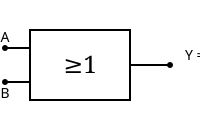
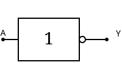
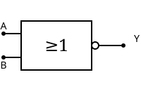
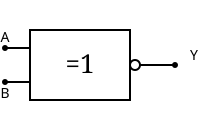

# 数制与码制

## 不同数制间的转换

### 任意进制 → 十进制（按权展开法）

将每位数字乘以该位的权值后求和。

- 二进制：$(1011.01)_2 = 1 \times 2^3 + 0 \times 2^2 + 1 \times 2^1 + 1 \times 2^0 + 0 \times 2^{-1} + 1 \times 2^{-2} = (11.25)_{10}$
- 八进制：$(257)_8 = 2 \times 8^2 + 5 \times 8^1 + 7 \times 8^0 = (175)_{10}$
- 十六进制：$(3A)_{16} = 3 \times 16^1 + 10 \times 16^0 = (58)_{10}$

### 十进制 → 任意进制

**整数部分：除基取余法（逆序）**
不断除以目标进制基数，取余数，直到商为0，余数倒序排列。

例：$(25)_{10} \rightarrow (11001)_2$

```
25 ÷ 2 = 12 余 1  ↑
12 ÷ 2 = 6  余 0  │
6  ÷ 2 = 3  余 0  │
3  ÷ 2 = 1  余 1  │
1  ÷ 2 = 0  余 1  ↑  (从下往上读)
```

**小数部分：乘基取整法（顺序）**
不断乘以目标进制基数，取整数部分，直到小数部分为0或达到精度要求，顺序排列。

例：$(0.375)_{10} \rightarrow (0.011)_2$

```
0.375 × 2 = 0.75 → 0  ↓
0.75  × 2 = 1.5  → 1  │
0.5   × 2 = 1.0  → 1  ↑  (从上往下读)
```

### 二进制 ↔ 八进制/十六进制（三位/四位分组法）

- 二进制 → 八进制：从小数点开始，整数部分向左、小数部分向右每3位一组，每组转换为1位八进制数。
- 二进制 → 十六进制：每4位一组，转换为1位十六进制数。
- 八进制/十六进制 → 二进制：每位转换为对应的3位/4位二进制数。

例：$(1011010.1)_2 \rightarrow (001\,011\,010.\,100)_2 = (132.4)_8$

例：$(1011010.1)_2 \rightarrow (0101\,1010.\,1000)_2 = (5A.8)_{16}$

---

## 二进制数的运算

### 算术运算

**加法规则**：$0+0=0,\;0+1=1,\;1+0=1,\;1+1=0\ (\text{进位}1)$

**减法规则**：$0-0=0,\;1-0=1,\;1-1=0,\;0-1=1\ (\text{借位}1)$

**乘法规则**：$0\times0=0,\;0\times1=0,\;1\times0=0,\;1\times1=1$

### 逻辑运算

| 运算 | 符号 | 规则 |
|:---:|:---:|:---:|
| 与 (AND) | $\cdot$ 或 $\land$ | 全1为1，有0为0 |
| 或 (OR) | $+$ 或 $\lor$ | 有1为1，全0为0 |
| 非 (NOT) | $\overline{A}$ 或 $\lnot$ | 取反 |
| 异或 (XOR) | $\oplus$ | 相同为0，不同为1 |

---

## 原码 反码 补码

设真值为 $x$，字长为 $n$ 位（含符号位）：

### 原码

- 符号位：0正1负，数值位不变
- 表示范围：$-(2^{n-1}-1) \sim +(2^{n-1}-1)$
- 例：$[+3]_原 = 00011,\quad [-3]_原 = 10011$
- 缺点：$0$ 有两种表示 $(00000 \text{ 和 } 10000)$，减法实现复杂

### 反码

- 正数：与原码相同
- 负数：符号位为1，数值位按位取反
- 例：$[+3]_反 = 00011,\quad [-3]_反 = 11100$
- $0$ 同样有两种表示

### 补码

- 正数：与原码、反码相同
- 负数：反码末位加1
- 例：$[+3]_补 = 00011,\quad [-3]_补 = 11101$
- $0$ 唯一表示：$00000$
- 表示范围：$-2^{n-1} \sim +(2^{n-1}-1)$，比原码/反码多表示一个最小负数

**补码的优势**：将减法转化为加法，只需加法器即可完成加减运算。

$$
[x-y]_补 = [x]_补 + [-y]_补
$$

---

## 几种常见编码

### 8421码

- 最常用的BCD码（Binary-Coded Decimal）
- 用4位二进制数的0000～1001分别表示十进制数的0～9
- 各位权值分别为 $8,4,2,1$
- 例：$(259)_{10} = (0010\,0101\,1001)_{8421}$
- **注意**：$1010 \sim 1111$ 为无效码

### 余3码

- 由8421码加3 ($0011$) 得到
- 例：$(0)_{10} \rightarrow 0011,\quad (9)_{10} \rightarrow 1100$
- 特点：**自补性**——对余3码按位取反即得9的补数的余3码（如 $3 \rightarrow 0110$，$6 \rightarrow 1001$）

### 格雷码

- 相邻两个码之间仅有一位不同（**单位码距**）
- 典型构建方法：$n$ 位格雷码可由 $n-1$ 位格雷码镜像加前缀0/1得到

**二进制转格雷码**：
$$
G_i = B_i \oplus B_{i+1} \quad (\text{最高位 } G_{n-1} = B_{n-1})
$$

**格雷码转二进制**：
$$
B_{n-1} = G_{n-1} \\
B_i = G_i \oplus B_{i+1}
$$

# 逻辑代数基础

## 基本运算

### 与

| IEC矩形符号 | ANSI distinctive shape |
|:---:|:---:|
|  |  |

| A | B | Y = A·B |
|:---:|:---:|:---:|
| 0 | 0 | 0 |
| 0 | 1 | 0 |
| 1 | 0 | 0 |
| 1 | 1 | 1 |

- 逻辑表达式：$Y = A \cdot B$
- 口诀：**有0出0，全1出1**
- 实现：串联开关电路

### 或

| IEC矩形符号 | ANSI distinctive shape |
|:---:|:---:|
|  |  |

| A | B | Y = A+B |
|:---:|:---:|:---:|
| 0 | 0 | 0 |
| 0 | 1 | 1 |
| 1 | 0 | 1 |
| 1 | 1 | 1 |

- 逻辑表达式：$Y = A + B$
- 口诀：**有1出1，全0出0**
- 实现：并联开关电路

### 非

| IEC矩形符号 | ANSI distinctive shape |
|:---:|:---:|
|  |  |

| A | Y = Ā |
|:---:|:---:|
| 0 | 1 |
| 1 | 0 |

- 逻辑表达式：$Y = \overline{A}$ 或 $Y = A'$
- 功能：取反
- 又称**反相器**

### 与非

| IEC矩形符号 | ANSI distinctive shape |
|:---:|:---:|
|  |  |

| A | B | Y = $\overline{A \cdot B}$ |
|:---:|:---:|:---:|
| 0 | 0 | 1 |
| 0 | 1 | 1 |
| 1 | 0 | 1 |
| 1 | 1 | 0 |

- 逻辑表达式：$Y = \overline{A \cdot B}$
- 口诀：**有0出1，全1出0**
- **通用门**：可单独构成任何逻辑电路

### 或非

| IEC矩形符号 | ANSI distinctive shape |
|:---:|:---:|
|  |  |

| A | B | Y = $\overline{A + B}$ |
|:---:|:---:|:---:|
| 0 | 0 | 1 |
| 0 | 1 | 0 |
| 1 | 0 | 0 |
| 1 | 1 | 0 |

- 逻辑表达式：$Y = \overline{A + B}$
- 口诀：**有1出0，全0出1**
- **通用门**：可单独构成任何逻辑电路

### 异或

| IEC矩形符号 | ANSI distinctive shape |
|:---:|:---:|
|  |  |

| A | B | Y = A ⊕ B |
|:---:|:---:|:---:|
| 0 | 0 | 0 |
| 0 | 1 | 1 |
| 1 | 0 | 1 |
| 1 | 1 | 0 |

- 逻辑表达式：$Y = A \oplus B = A\overline{B} + \overline{A}B$
- 口诀：**相同为0，不同为1**
- 特性：可控反相器（$A \oplus 0 = A,\; A \oplus 1 = \overline{A}$）

### 同或

| IEC矩形符号 | ANSI distinctive shape |
|:---:|:---:|
|  |  |

| A | B | Y = A ⊙ B |
|:---:|:---:|:---:|
| 0 | 0 | 1 |
| 0 | 1 | 0 |
| 1 | 0 | 0 |
| 1 | 1 | 1 |

- 逻辑表达式：$Y = A \odot B = AB + \overline{A}\,\overline{B}$
- 口诀：**相同为1，不同为0**
- 关系：$A \odot B = \overline{A \oplus B}$（异或的非）

---

## 逻辑代数基本定律

### 基本定律

| 定律 | 与运算形式 | 或运算形式 |
|:---:|:---:|:---:|
| **0-1律** | $A \cdot 0 = 0$ | $A + 1 = 1$ |
| **自等律** | $A \cdot 1 = A$ | $A + 0 = A$ |
| **互补律** | $A \cdot \overline{A} = 0$ | $A + \overline{A} = 1$ |
| **重叠律** | $A \cdot A = A$ | $A + A = A$ |
| **双重否定律** | $\overline{\overline{A}} = A$ | — |
| **交换律** | $A \cdot B = B \cdot A$ | $A + B = B + A$ |
| **结合律** | $(AB)C = A(BC)$ | $(A+B)+C = A+(B+C)$ |
| **分配律** | $A(B+C) = AB + AC$ | $A + BC = (A+B)(A+C)$ |

### 摩根定律（De Morgan's Laws）

$$
\overline{A \cdot B} = \overline{A} + \overline{B} \qquad
\overline{A + B} = \overline{A} \cdot \overline{B}
$$

推广到 $n$ 个变量：

$$
\overline{A_1 A_2 \cdots A_n} = \overline{A_1} + \overline{A_2} + \cdots + \overline{A_n}
$$

$$
\overline{A_1 + A_2 + \cdots + A_n} = \overline{A_1} \cdot \overline{A_2} \cdots \overline{A_n}
$$

**记忆方法**：**头上断，运算变**（与变或，或变与，每个变量取反）

### 常用公式

| 公式 | 说明 |
|:---|:---|
| $A + AB = A$ | 吸收律 |
| $A + \overline{A}B = A + B$ | 冗余律 |
| $AB + A\overline{B} = A$ | 并项法 |
| $AB + \overline{A}C + BC = AB + \overline{A}C$ | 冗余项消除 |

---

## 逻辑函数的化简

### 化简目的

- 减少逻辑门数量 → 降低成本、提高可靠性、减小体积
- 最简形式：**乘积项最少、每个乘积项因子最少**（与或式）

### 公式法化简

| 方法 | 公式 | 示例 |
|:---:|:---|:---|
| **并项法** | $AB + A\overline{B} = A$ | $A\overline{B} + A\overline{B}C = A\overline{B}$ |
| **吸收法** | $A + AB = A$ | $\overline{A}B + \overline{A}BC = \overline{A}B$ |
| **消去法** | $A + \overline{A}B = A + B$ | $A + \overline{A}BC = A + BC$ |
| **配项法** | $A = A(B + \overline{B})$ | 引入互补项后合并 |

### 卡诺图化简

**基本概念**：
- 卡诺图是真值表的图形化表示
- 相邻方格之间仅有一位不同（格雷码排列）

**2变量卡诺图**：

```
      ┌────┬────┐
      │ 0  │ 1  │
  ┌───┼────┼────┤
  │ 0 │ m₀ │ m₁ │
  ├───┼────┼────┤
  │ 1 │ m₂ │ m₃ │
  └───┴────┴────┘
```

**3变量卡诺图**：

```
    AB    00   01   11   10
  C ┌────┬────┬────┬────┐
  0 │ m₀ │ m₁ │ m₃ │ m₂ │
    ├────┼────┼────┼────┤
  1 │ m₄ │ m₅ │ m₇ │ m₆ │
    └────┴────┴────┴────┘
```

**化简步骤**：
1. 将逻辑函数填入卡诺图（最小项对应格填1）
2. 圈出所有 **$2^n$ 个相邻的1**（圈越大越好）
3. 每个圈对应一个乘积项
4. 读取各圈公因子，求或得最简式

**圈1原则**：
- 圈尽可能大（但必须是 $1,2,4,8,\dots$ 个方格）
- 圈尽可能少
- 允许重复圈（重叠的1）
- 卡诺图上下、左右相邻（循环相邻）
- 每个1必须至少被圈一次