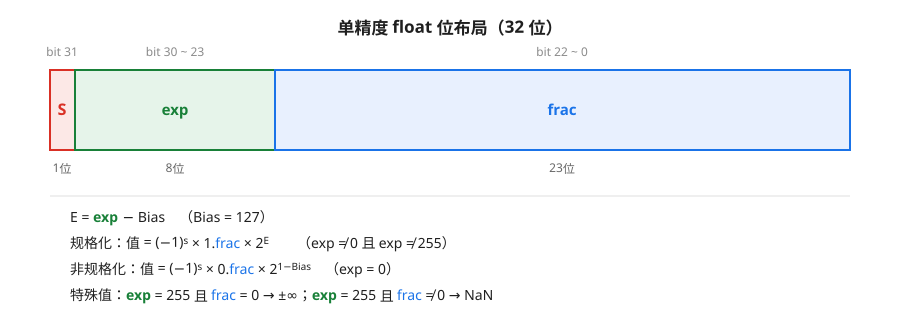
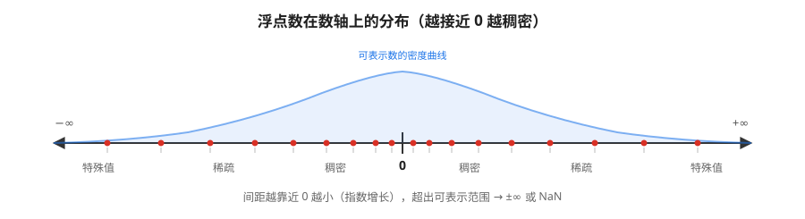

# 深入理解计算机系统

## 程序结构和执行

### 信息的表示和处理 [^1]

#### 2.1 信息存储

+ 现代计算机使用**字节(byte)**寻址系统，每个字节对应唯一的内存地址
+ 程序对象（数据、指令）以**字节序列**存储在内存中，机器通过**虚拟地址(virtual address)**访问这些对象
+ 虚拟地址空间：字长 w 的机器可访问 0 ~ 2^w-1 共 2^w 个地址，即最多 2^w 字节

##### 2.1.1 十六进制表示法[^2]

[^2]: 为什么用十六进制：每4个二进制位对应1个十六进制位，可读性强，转换方便。

+ 一个字节 = 8位 = 2个十六进制位
+ 十六进制数字：0~9 与 A~F（代表 10~15），编程中常用 0x 或 0X 前缀，如 0xAF = 175
+ 十六进制与二进制转换：**逐组映射**，每1个十六进制位 ↔ 4个二进制位
  + 0x5A2B → 0101 1010 0010 1011
  + 0x8000 → 1000 0000 0000 0000
+ 十六进制与十进制转换
  + 十进制→十六进制：不断除以16，取余数，余数从低位往高位排列
  + 十六进制→十进制：Σ 各位 × 16^k，如 0x11 = 1×16 + 1 = 17
+ 常见练习值
  + 0xA=10，0xF=15，0x10=16，0xFF=255，0x100=256
  + 0x80000000 = -2147483648（32位补码最小值，见2.2）

##### 2.1.2 字长与数据大小

+ **字长(word size)**：指针（地址）的字节数，决定虚拟地址空间大小 = 2^w 字节
  + 32位程序：最大 4GB 空间；64位程序：最大 16EB（实际只使用低48位，约256TB）
+ 同一个程序编译为32位/64位时，有些类型大小会变化，**long 和指针最典型**
+ C语言基本数据类型大小（64位 x86-64 典型值，可用 sizeof 确认）

| C类型 | 位数 | C类型 | 位数 |
| :--- | :---: | :--- | :---: |
| char | 8 | long | 64（32位系统上为32） |
| short | 16 | long long | 64 |
| int | 32 | 指针 char* 等 | 64 |
| unsigned int | 32 | float | 32 |
| unsigned long | 64 | double | 64 |

+ 编程注意：跨平台代码不要假定 int 与 long 同宽，用 sizeof 或固定宽度类型 stdint.h 的 int32_t、int64_t
+ 有符号的 char 在不同机器上可能默认为有符号或无符号，C标准未规定，由实现决定

##### 2.1.3 寻址与字节顺序（大小端）

+ 多字节对象在内存中按**字节地址连续存放**，但字节排列顺序有两种约定
  + **小端法(little endian)**：最低有效字节放在最低地址位置（x86、大多数PC）
  + **大端法(big endian)**：最高有效字节放在最低地址位置（早期PowerPC、网络字节序）
+ 以 int 值 0x01234567 为例（每个格子是一个字节）：

```markdown
地址：      0x100    0x101    0x102    0x103
大端法：    01       23       45       67
小端法：    67       45       23       01

```

+ 大小端何时会出问题？
    1. 网络传输：网络协议（如TCP/IP头）规定用**大端**，发送/接收端可能需要字节反转（htons/ntohl）
    2. 反汇编代码、查看内存dump：阅读机器级代码时需要知道字节序
    3. 类型的强制转换：按字节访问多字节对象时结果依赖字节序
+ 用代码确认机器的大小端（C语言）

```c
#include <stdio.h>
typedef unsigned char *byte_pointer;

void show_bytes(byte_pointer start, size_t len) {
    for (size_t i = 0; i < len; i++)
        printf(" %.2x", start[i]);
    printf("\n");
}

int main(void) {
    int x = 0x01234567;
    show_bytes((byte_pointer)&x, sizeof(int));
    // 小端机器输出： 67 45 23 01
    // 大端机器输出： 01 23 45 67
    return 0;
}
```

##### 2.1.4 表示字符串

+ 字符串由字符码的字节序列表示，常见采用 ASCII 编码
+ 例如字符串 "12345"（C语言）在内存中的字节为 `31 32 33 34 35 00`（最后是终止符 '\0' 即 0x00）
+ ASCII 记忆点：'0'=0x30，'A'=0x41，'a'=0x61；数字与字符差 0x30，大小写字母差 0x20
+ 字符串逐字节存储，与**大小端无关**，因此跨平台安全；多字节字符（中文GBK/UTF-8）取决于具体编码规范

##### 2.1.5 表示代码

+ 指令也以字节序列表示，**但不是普通数据**：同一段C代码编译出的机器码在不同指令集架构（x86-64/ARM/MIPS）上完全不同
+ 机器码不是"标准化的"，不能直接把 x86 的二进制搬到 ARM 上运行
+ 反汇编（如 objdump -d）可把字节序列翻译回汇编，供人阅读

##### 2.1.6 布尔代数

+ 二进制与逻辑值：bit=1 表示"真"，0 表示"假"
+ 基本布尔运算：非(~)、与(&)、或(|)、异或(^)[^3]

[^3]: 异或 x^y 在且仅在不相等时为1，即"比特位不同"。异或很有用的性质：x^0=x，x^x=0，x^y^y=x（可用于不用临时变量的交换或简单加密）

```markdown
A B | ~A | A&B | A|B | A^B
0 0 | 1  |  0  |  0  |  0
0 1 | 1  |  0  |  1  |  1
1 0 | 0  |  0  |  1  |  1
1 1 | 0  |  1  |  1  |  0
```

+ 常用定律（与集合论一一对应）
  + 交换律 / 结合律 / 分配律：A&(B|C) = (A&B)|(A&C)，A|(B&C) = (A|B)&(A|C)
  + **德摩根律**：~(A|B) = ~A & ~B；~(A&B) = ~A | ~B
  + 补集：A & ~A = 0，A | ~A = 1（满位）

##### 2.1.7 C语言中的位级、逻辑与移位运算

+ **位级运算**：~ & | ^ 操作对象是整数，对**每一位**独立计算

```c
int x = 0x0F, y = 0x30;
x & y        // 0x00  按位与
x | y        // 0x3F  按位或
x ^ y        // 0x3F  按位异或
~x           // 0xFFFFFFF0 （对32位int）
// 常用技巧：取低8位 x & 0xFF；只翻转某一位 x ^ (1<<k)
```

+ 注意位级运算与比较运算的**优先级坑**：与(&)优先级低于 ==，所以 `x & 0xFF == 0` 会被解析为 `x & (0xFF==0)`，务必加括号
+ **逻辑运算**：! && || 返回值只能是 0 或 1
  + 与位级运算的区别：对整体真值判断，而非逐位；有**短路**求值（左侧已能决定结果则不计算右侧）

```c
int x = 0, y = 5;
x && (y = 10);   // x为假，短路：右侧不求值，y 仍是 5
!x               // 1
!!x              // 0  用两个!!可把任意非零值规范化为 0/1
```

+ **移位运算**：左移 `<<`，右移 `>>`
  + x86上对有符号数右移是**算数右移**（补符号位）；对无符号数是**逻辑右移**（补0）
  + 左移丢弃最高位、低位补0：x << 2 等价于 x×4（无溢出时）
  + 算数右移等价于除以2的幂（向下取整，见2.3.5）
  + **移位量 >= 字长是未定义行为**；移位量为负同样未定义。如 `int x = 1; x << 32` 结果不可
+ 无符号编码是**双射**：w位位向量 ↔ {0, 1, …, 2^w-1} 一一对应，不浪费任何位模式

##### 2.2.3 补码编码 B2T

+ 有符号数在几乎所有机器上都用**补码(two's complement)**表示，最高位的权重是**负的**
+ 为什么用补码？在补码下**加法和减法共用一套加法器**：x - y = x + (~y + 1)，硬件简单；原码、反码则正负数的加法规则不同
+ w=4 时补码的数环：

```markdown

0101 = 5      1000 = -8
0111 = 7      1111 = -1
0000 = 0      1111 + 1 → 0000 （溢出回卷）

```

+ 验证方法：任意 w 位"按位取反再加一"就是取负
+ 补码特性：**TMin 的非还是 TMin 本身**（1000...0 取反加1还是 1000...0）；-0 与 0 相同，没有浪费

##### 2.2.4 有符号与无符号的转换

+ 位级层面**不发生任何变化**，变的只是解释方式，转换是纯数学映射
+ T2U_w(x)：若 x < 0，则 T2U_w(x) = x + 2^w，否则不变
  + 例：-1 → 0xFFFFFFFF（32位）
+ U2T_w(u)：若 u >= 2^(w-1)，则 U2T_w(u) = u - 2^w，否则不变
  + 例：0x80000000（无符号读为 2147483648）→ -2147483648
+ 数学本质：两者是**模 2^w 的同余关系**，只是取值区间的裁剪不同

```markdown

位模式 0b1100 (w=4)：无符号 = 12，有符号 = -4（= 12 - 16）

```

##### 2.2.5 C语言中的有符号数与无符号数[^4]

[^4]: C标准规定：当运算符两侧一个有符号一个无符号且宽度相同时，**有符号数被隐式转为无符号**（除非有符号类型范围能包含所有无符号值）。这是无数bug的源头。

+ 隐式转换的坑：**-1 < 0U 为假**！因为 -1 先转成 0xFFFFFFFF = 4294967295，再与 0U 比较
+ 经典bug：for 循环用无符号数递减到负数时，条件永远成立

```c
unsigned i;
for (i = n; i > 0; i--);   // 正确写法：i==0 时退出
// 反例：i >= 0 永远为真 → 死循环或越界
```

+ 再如 strlen 返回 size_t（无符号）：`strlen(a) - strlen(b) > 0` 在 a 短于 b 时依然为"真"（变成巨大的无符号数）
+ 经验：比较运算里**不要混用有符号与无符号**；printf 用 %d/%u 与类型不匹配也会读错值

##### 2.2.6 扩展数字的位表示

+ 扩展（短类型→长类型）有两种，位模式不变只是高位补齐
  + **零扩展**：高位补0，用于无符号 short→int
  + **符号扩展**：高位补原最高位的符号位，用于有符号 short→int
+ 关键理解：符号扩展不会改变数值大小（补充的高位权重恰好与原符号位等值）

```c
short sx = -12345;        // 位模式 0xCFC7
unsigned short usx = sx;  // 0xCFC7 （65533，无符号解释）
int x = sx;               // 0xFFFFCFC7 （符号扩展到32位，仍是 -12345）
unsigned uy = usx;        // 0x0000CFC7 （零扩展）
```

##### 2.2.7 截断数字

+ 长类型→短类型：只保留低 k 位，即**取模 2^k**
  + 例：unsigned 0xFFFFFFFF (4294967295) 截断为 unsigned short → 0xFFFF = 65535 = 4294967295 mod 65536
+ 无符号截断 = 模 2^k 运算；有符号截断 = 先模 2^k 得到无符号值，再按有符号解释（可能变负数）

#### 2.3 整数运算
>
> 这一节是"溢出"的来源。C语言整数运算按 w 位计算，**超过 w 位的结果直接被丢弃（回卷 wrap-around）**，不报错、不抛异常。

##### 2.3.1 无符号加法

+ 常规加法 s = x + y，溢出时取 s mod 2^w（最高位进位丢弃）
+ **溢出检测**：无符号加法溢出当且仅当 s < x（等价于 s < y），因为溢出意味着结果回卷变小

```c
unsigned x = 0xFFFFFFFF, y = 1;
unsigned s = x + y;   // 0x00000000，溢出；检测：s < x → 溢出
```

##### 2.3.2 补码加法

+ 补码加法是把 x+y 按**模 2^w** 计算后再解释为有符号数，会出现两种溢出
  + **正溢出（上溢）**：两个正数之和超过 TMax，结果变负
  + **负溢出（下溢）**：两个负数之和小于 TMin，结果变正
+ 检测规则
  + 正溢出：x > 0，y > 0，但 s < 0
  + 负溢出：x < 0，y < 0，但 s >= 0

```c
int x = 0x7FFFFFFF, y = 1;
int s = x + y;        // 0x80000000 = -2147483648（正溢出，和变成负数）
```

```markdown
补码数环(w=4)： 7+1 → 1000 = -8（正溢出，跨过顶端到负区）
               -8 + -1 → 0111 = 7（负溢出）
```

##### 2.3.3 补码的非（取反）

+ 求 -y（w位）：**按位取反再加1**，-y = ~y + 1
+ 特例：TMin 的非是它自身（它没有正数对应）
+ 应用：减法 x - y 硬件上统一用加法实现：x + (~y + 1)

##### 2.3.4 乘法

+ w位乘法：把 x·y 的完整乘积**截断到低 w 位**（模 2^w），高位丢弃
+ 无符号乘法：x·y mod 2^w
+ 补码乘法：完整乘积截断后按有符号解释
+ **重要结论：无符号乘法与补码乘法的 w 位结果（位模式）完全相同**——模 2^w 同余的必然结果
+ 溢出例子：200×300×400×500

```c
int x = 200 * 300 * 400 * 500;        // 真实值120亿 > 21亿，截断后 = -884901888
unsigned u = 200u * 300u * 400u * 500u; // 3410065408 = 120亿 mod 2^32
```

##### 2.3.5 乘以常数与除以2的幂

+ **乘以 2 的幂**：x << k 等价于 x × 2^k（无溢出时）；编译器会把 x*2^k 优化为移位
+ **乘以任意常数**：拆成移位+"加减"组合，如 x × 14 = (x<<4) - (x<<2)，x × 15 = (x<<4) - x

```c
// 编译器实际就是这么优化的（第3章机器级表示会看到）
x * 14;   // 等价于 (x << 4) - (x << 2)
x * 7;    // 等价于 (x << 3) - x
```

+ **除以 2 的幂**：无符号数 x >> k（逻辑右移）即 x/2^k，向下取整
+ 对有符号数，直接算数右移得到的是 **floor（向负无穷舍入）**，而 C 的 / 是**向零舍入**，负数时不一致：-7/2 = -3（向零），-7>>1 = -4（floor）
+ **加偏置修复**：要让移位除法等于"向零舍入"，先加偏置 bias = 2^k - 1 再右移
+ 即 `(x + (1<<k) - 1) >> k`（x >= 0 时偏置不影响结果，同样成立）

```c
int x = -7, k = 2;
int a = x >> k;                 // -7>>2 = -2（floor，不匹配 C 的 -7/4=-1）
int b = (x + (1<<k) - 1) >> k;  // (-7+3)>>2 = (-4)>>2 = -1 = -7/4 ✓
```

+ 提示：编译器处理 x/8 时，对负数会生成"加偏置再算数右移"的指令序列（第3章可见）

#### 2.4 浮点数
>
> 浮点数只能表示实数的近似子集：靠近0的数最稠密，越远越稀疏。浮点运算是有限精度、**可能舍入**的，IEEE 754 是标准格式。

##### 2.4.1 二进制小数

+ 二进制小数逢二进一，小数点右边第 k 位的权重是 1/2^k

```markdown
二进制小数： 101.101₂ = 4 + 1 + 1/2 + 1/8 = 5.625
              0.1011₂ = 1/2 + 0/4 + 1/8 + 1/16 = 0.6875
```

+ 注意：很多十进制小数（如 0.1）在二进制下是**无限循环小数**，永远无法精确表示 → 浮点误差的根源
+ 类比：浮点数就是二进制科学计数法（十进制 1.234×10^2 ↔ 二进制 1.xxx×2^E）

##### 2.4.2 IEEE浮点表示

+ 一个浮点数用 **V = (−1)^s × M × 2^E** 表示
  + s：符号位(sign)
  + M：尾数(significand)，范围 [1,2) 或 [0,1)
  + E：阶码(exponent)
+ 两种格式

| 格式 | 总位数 | 符号s | 阶码exp | 尾数frac | Bias |
| :--- | :---: | :---: | :---: | :---: | :---: |
| 单精度 float | 32 | 1 | 8 | 23 | 127 |
| 双精度 double | 64 | 1 | 11 | 52 | 1023 |



+ 三种编码情形（以单精度为例）
  + **规格化的值(normalized)**：exp 不全0也不全1（1~254）。尾数隐含最高位1，即 M = 1.frac
    + E = exp - 127
    + 例：1.0 → exp = 127（0111 1111），frac 全0
  + **非规格化的值(denormalized)**：exp 全0。此时 M = 0.frac，E = 1 - Bias（固定），用于表示**0 和极其接近 0 的数**（渐进下溢，保证数轴上相邻浮点数间距连续）
  + **特殊值**：exp 全1
    + frac 全0 → ±∞（如 1.0/0.0）
    + frac 非0 → NaN（Not a Number，如 0.0/0.0、sqrt(-1)）



##### 2.4.3 浮点数字示例

+ 例：12.375 的 float 编码
  + 12.375 = 1100.011₂ = 1.100011 × 2^3
  + exp = 3 + 127 = 130 = 10000010
  + frac = 100011 后补0至23位 → 10001100000000000000000
  + 编码：0 10000010 10001100000000000000000
+ 关键数值（单精度）
  + 最小正规格化数：2^-126 ≈ 1.2e-38
  + 最大正规格化数：(2 - 2^-23) × 2^127 ≈ 3.4e38
  + 最小正非规格化数：2^-149 ≈ 1.4e-45
  + 机器精度 epsilon：2^-23 ≈ 1.19e-7（float），2^-52 ≈ 2.2e-16（double）

##### 2.4.4 舍入

+ 运算结果无法精确表示时必须舍入，IEEE 定义四种模式
  + **向偶数舍入（round-to-even，默认）**：舍入到最近的值，恰好在正中间时舍入到最低位为偶数（偶数的）那个
    + 十进制例：1.5→2，2.5→2，3.5→4；二进制例：1.011 舍入到小数点后2位 → 1.10（因为 1.011 恰在 1.01 与 1.10 中间，取偶数尾0）
  + 向零舍入、向下舍入、向上舍入：一般只在计算定积分上下界等场景手动指定
+ 为什么默认向偶数：避免统计误差单方向累积（如 1.5+2.5 各舍入到2，不偏不倚）

##### 2.4.5 浮点运算

+ 浮点加/乘的结果先精确计算再舍入到最近可表示值，**可能损失精度**
+ 浮点运算**不满足结合律和分配律**：

```c
// 1e20 很大，3.14 在舍入时被"吞掉"
(3.14 + 1e20) - 1e20   // → 0.0
3.14 + (1e20 - 1e20)   // → 3.14

// 结果随顺序变化，是很多数值算法误差的来源
```

+ 浮点数的交换律成立（加法、乘法都交换），只是结合律、分配律不成立
+ 浮点比较要小心：直接比较相等（==）在计算结果有舍入时容易失败，常用差值容差判断

```c
float a = 0.1f, b = 0.2f;
// a + b == 0.3f 通常为假！应改用 fabs(a + b - 0.3f) < 1e-6
```

##### 2.4.6 C语言中的浮点数

+ C 提供 float（单精度）、double（双精度）、long double（扩展精度，实现相关）
+ int/float/double 之间转换规则
  + int → float：可能**舍入损失精度**（float尾数只有24位有效，>2^24的int可能不准）
  + int → double：精确（double 53位尾数 ≥ 32位int）
  + float → double：精确（变宽）
  + double → float：可能**溢出为 ±∞** 或损失精度
  + float/double → int：向零截断，且**溢出行为未定义**（超出int范围的结果不可预知）

```c
int i = 16777217;      // 2^24 + 1
float f = i;           // f = 16777216.0（损失1，float无法表示 2^24+1）
double d = i;          // d = 16777217.0（精确）
int j = (int)3.9e10;   // 未定义行为，不要这样写
```

+ 何时用 float：嵌入式/GPU等对内存和速度敏感的场景；科学计算默认 double

#### 本章小结

+ 计算机用有限位模式编码信息，**编码 = 解释规则**
+ 无符号编码 B2U：0 ~ 2^w-1；补码 B2T：-2^(w-1) ~ 2^(w-1)-1，最高位权重为负
+ 位模式在转换中不变，变化的只是解释（有符号↔无符号、扩展、截断都是模 2^w 运算）
+ 整数运算溢出即回卷，C不报错；注意有符号/无符号混用的隐式转换
+ 浮点遵循 IEEE 754：规格化/非规格化/特殊值，默认向偶数舍入，运算不满足结合律
+ 常见考点：大小端打印、补码转换、溢出检测、乘法截断、浮点编码与舍入、0.1+0.2 != 0.3
